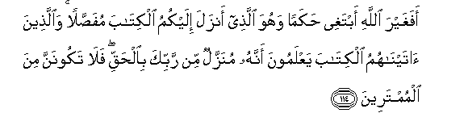

# أَفَغَيْرَ اللَّهِ أَبْتَغِي حَكَمًا وَهُوَ الَّذِي أَنْزَلَ إِلَيْكُمُ الْكِتَابَ مُفَصَّلًا ۚ وَالَّذِينَ آتَيْنَاهُمُ الْكِتَابَ يَعْلَمُونَ أَنَّهُ مُنَزَّلٌ مِنْ رَبِّكَ بِالْحَقِّ ۖ فَلَا تَكُونَنَّ مِنَ الْمُمْتَرِينَ

##Afaghayra Allahi abtaghee hakaman wahuwa allathee anzala ilaykumu alkitaba mufassalan waallatheena ataynahumu alkitaba yaAAlamoona annahu munazzalun min rabbika bialhaqqi fala takoonanna mina almumtareena 

## 翻译(Translation)：

| Translator | 译文(Translation)                                            |
| :--------: | ------------------------------------------------------------ |
|    马坚    | （你说）：真主已降示你们详明的天经，难道我还要舍真主而别求判决者吗？蒙我赏赐经典的人，他们知道这是你的主降示的，包含真理的经典，故你绝不要犹豫。 |
|  YUSUFALI  | Say: "Shall I seek for judge other than Allah? when He it is Who hath sent unto you the Book explained in detail." They know full well to whom We have given the Book that it hath been sent down from thy Lord in truth. Never be then of those who doubt. |
| PICKTHALL  | Shall I seek other than Allah for judge, when He it is Who hath revealed unto you (this) Scripture, fully explained ? Those unto whom We gave the Scripture (aforetime) know that it is revealed from thy Lord in truth. So be not thou (O Muhammad) of the waverers. |
|   SHAKIR   | Shall I then seek a judge other than Allah? And He it is Who has revealed to you the Book (which is) made plain; and those whom We have given the Book know that it is revealed by your Lord with truth, therefore you should not be of the disputers. |

---

## 对位释义(Words Interpretation)：

| No   | العربية | 中文    | English | 曾用词 |
| ---- | ------: | ------- | ------- | ------ |
| 序号 |    阿文 | Chinese | 英文    | Used   |
| 6:114.1  | أَفَغَيْرَ    | 然后之外吗？           | Is it then other      | 见3:83.1  |
| 6:114.2  | اللَّهِ     | 真主的                 | of Allah              | 见2:23.17 |
| 6:114.3  | أَبْتَغِي    | 我寻求                 | I seek                |           |
| 6:114.4  | حَكَمًا     | 一个公证人             | an arbiter            | 见4:35.6  |
| 6:114.5  | وَهُوَ      | 和他                   | and he                | 见2:29.16 |
| 6:114.6  | الَّذِي     | 谁，那些               | those who             | 见2:6.2   |
| 6:114.7  | أَنْزَلَ     | 下降，颁降，降示，揭秘 | get down              | 见2:4.4   |
| 6:114.8  | إِلَيْكُمُ    | 至你们                 | to you                | 见4:90.29 |
| 6:114.9  | الْكِتَابَ   | 这部经，这本书         | the book              | 见2:2.2   |
| 6:114.10 | مُفَصَّلًا    | 详细的                 | explained in detail   |           |
| 6:114.11 | وَالَّذِينَ   | 和那些                 | and those who         | 见2:21.8  |
| 6:114.12 | آتَيْنَاهُمُ  | 我们给他们             | We gave them          | 见2:121.2 |
| 6:114.13 | الْكِتَابَ   | 这部经，这本书         | the book              | 见2:2.2   |
| 6:114.14 | يَعْلَمُونَ   | 知道                   | Know                  | 见2:13.19 |
| 6:114.15 | أَنَّهُ      | 他是                   | that he is            | 见2:26.16 |
| 6:114.16 | مُنَزَّلٌ     | 它被降临               | it has been sent down |           |
| 6:114.17 | مِنْ       | 从                     | from                  | 见2:4.8   |
| 6:114.18 | رَبِّكَ      | 您的主                 | Your Lord             | 见2:147.3 |
| 6:114.19 | بِالْحَقِّ    | 以真理                 | with truth            | 见2:71.20 |
| 6:114.20 | فَلَا      | 因此不                 | shall not             | 见2:22.18 |
| 6:114.21 | تَكُونَنَّ    | 你是                   | you are               | 见2:147.5 |
| 6:114.22 | مِنَ       | 从                     | from                  | 见2:4.8   |
| 6:114.23 | الْمُمْتَرِينَ | 怀疑                   | doubt                 | 见2:147.7 |

---