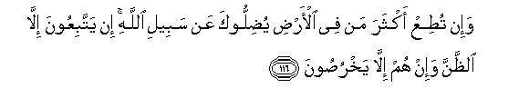

#وَإِنْ تُطِعْ أَكْثَرَ مَنْ فِي الْأَرْضِ يُضِلُّوكَ عَنْ سَبِيلِ اللَّهِ ۚ إِنْ يَتَّبِعُونَ إِلَّا الظَّنَّ وَإِنْ هُمْ إِلَّا يَخْرُصُونَ

##Wain tutiAA akthara man fee alardi yudillooka AAan sabeeli Allahi in yattabiAAoona illa alththanna wain hum illa yakhrusoona 

## 翻译(Translation)：

| Translator | 译文(Translation)                                            |
| :--------: | ------------------------------------------------------------ |
|    马坚    | 如果你顺从大地上的大多数人，那末，他们会使你叛离主道。他们只凭猜测，他们尽说谎话。 |
|  YUSUFALI  | Wert thou to follow the common run of those on earth they will lead thee away from the Way of Allah. They follow nothing but conjecture: they do nothing but lie. |
| PICKTHALL  | If thou obeyedst most of those on earth they would mislead thee far from Allah's way. They follow naught but an opinion, and they do but guess. |
|   SHAKIR   | And if you obey most of those in the earth, they will lead you astray from Allah's way; they follow but conjecture and they only lie. |

---

## 对位释义(Words Interpretation)：

| No   | العربية | 中文    | English | 曾用词 |
| ---- | ------: | ------- | ------- | ------ |
| 序号 |    阿文 | Chinese | 英文    | Used   |
| 6:116.1  | وَإِنْ    | 和如果     | and if                | 见2:23.1 |
| 6:116.2  | تُطِعْ    | 你顺从     | you obey              |            |
| 6:116.3  | أَكْثَرَ   | 大多数     | most                  | 见2:243.25 |
| 6:116.4  | مَنْ     | 谁         | who                   | 见2:97.2   |
| 6:116.5  | فِي     | 在         | in                    | 见2:10.1   |
| 6:116.6  | الْأَرْضِ  | 大地       | Earth                 | 见2:22.4   |
| 6:116.7  | يُضِلُّوكَ  | 他们迷误你 | they will mislead you | 见4:113.10 |
| 6:116.8  | عَنْ     | 从         | on                    | 见2:48.6   |
| 6:116.9  | سَبِيلِ   | 道路       | the way               | 见2:154.6  |
| 6:116.10 | اللَّهِ   | 真主的     | of Allah              | 见2:23.17  |
| 6:116.11 | إِنْ     | 如果       | if                    | 见2:23.18  |
| 6:116.12 | يَتَّبِعُونَ | 他顺从     | he follow             | 见4:27.8   |
| 6:116.13 | إِلَّا    | 除了       | Except                | 见2:9.7    |
| 6:116.14 | الظَّنَّ   | 猜测       | conjecture            |            |
| 6:116.15 | وَإِنْ    | 和不       | and no                | 见2:78.8   |
| 6:116.16 | هُمْ     | 他们       | they                  | 见2:4.11   |
| 6:116.17 | إِلَّا    | 除了       | Except                | 见2:9.7    |
| 6:116.18 | يَخْرُصُونَ | 他们谎言   | they lie              |            |

---
