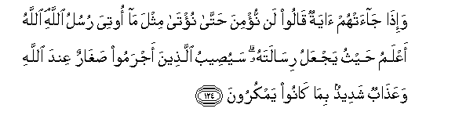

#وَإِذَا جَاءَتْهُمْ آيَةٌ قَالُوا لَنْ نُؤْمِنَ حَتَّىٰ نُؤْتَىٰ مِثْلَ مَا أُوتِيَ رُسُلُ اللَّهِ ۘ اللَّهُ أَعْلَمُ حَيْثُ يَجْعَلُ رِسَالَتَهُ ۗ سَيُصِيبُ الَّذِينَ أَجْرَمُوا صَغَارٌ عِنْدَ اللَّهِ وَعَذَابٌ شَدِيدٌ بِمَا كَانُوا يَمْكُرُونَ

##Waitha jaathum ayatun qaloo lan numina hatta nuta mithla ma ootiya rusulu Allahi Allahu aAAlamu haythu yajAAalu risalatahu sayuseebu allatheena ajramoo sagharun AAinda Allahi waAAathabun shadeedun bima kanoo yamkuroona 

## 翻译(Translation)：

| Translator | 译文(Translation)                                            |
| :--------: | ------------------------------------------------------------ |
|    马坚    | 当一种迹象降临他们的时候，他们说：我们绝不信，直到我们得受众使者所受的（启示）。真主是知道要把自己的使命安置在什么地方的。犯罪者，将因自己的计谋，而遭受真主那里的屈辱，和痛苦的刑罚。 |
|  YUSUFALI  | When there comes to them a Sign (from Allah) they say: "We shall not believe until we receive one (exactly) like those received by Allah's apostles." Allah knoweth best where (and how) to carry out His mission. Soon will the wicked be overtaken by humiliation before Allah and a severe punishment for all their plots. |
| PICKTHALL  | And when a token cometh unto them, they say: We will not believe till we are given that which Allah's messengers are given. Allah knoweth best with whom to place His message. Humiliation from Allah and heavy punishment will smite the guilty for their scheming. |
|   SHAKIR   | And when a communication comes to them they say: We will not believe till we are given the like of what Allah's apostles are given. Allah best knows where He places His message. There shall befall those who are guilty humiliation from Allah and severe chastisement because of what they planned. |

---

## 对位释义(Words Interpretation)：

| No   | العربية | 中文    | English | 曾用词 |
| ---- | ------: | ------- | ------- | ------ |
| 序号 |    阿文 | Chinese | 英文    | Used   |
| 6:124.1  | وَإِذَا   | 和当       | and when         | 见2:11.1   |
| 6:124.2  | جَاءَتْهُمْ | 他来至他们 | he came to them  | 见5:32.29  |
| 6:124.3  | آيَةٌ    | 迹象       | the Signs        | 见2:106.4  |
| 6:124.4  | قَالُوا  | 他们说，   | They said        | 见2:11.8   |
| 6:124.5  | لَنْ     | 绝不       | will not         | 见2:55.5   |
| 6:124.6  | نُؤْمِنَ   | 我们相信   | We believe       | 见2:55.6   |
| 6:124.7  | حَتَّىٰ    | 直到       | Until            | 见2:55.8   |
| 6:124.8  | نُؤْتَىٰ   | 我们被给   | we are given     |            |
| 6:124.9  | مِثْلَ    | 类似       | Like             | 见2:113.21 |
| 6:124.10 | مَا     | 什么       | what/ that which | 见2:17.8   |
| 6:124.11 | أُوتِيَ   | 他被给     | given to         | 见2:136.16 |
| 6:124.12 | رُسُلُ    | 众使者     | messengers       |            |
| 6:124.13 | اللَّهِ   | 真主的     | of Allah         | 见2:23.17  |
| 6:124.14 | اللَّهُ   | 安拉，真主 | Allah            | 见2:7.2    |
| 6:124.15 | أَعْلَمُ   | 至知       | know best        | 见2:30.25  |
| 6:124.16 | حَيْثُ    | 无论哪里   | Where            | 见2:35.11  |
| 6:124.17 | يَجْعَلُ   | 他安置     | He places        |            |
| 6:124.18 | رِسَالَتَهُ | 他的使命   | His message      | 见5:67.15  |
| 6:124.19 | سَيُصِيبُ  | 他将遭受   | he shall befall  |            |
| 6:124.20 | الَّذِينَ  | 谁，那些   | those who        | 见2:6.2    |
| 6:124.21 | أَجْرَمُوا | 他们犯罪   | they are guilty  |            |
| 6:124.22 | صَغَارٌ   | 羞辱       | humiliation      |            |
| 6:124.23 | عِنْدَ    | 以         | with             | 见2:54.20  |
| 6:124.24 | اللَّهِ   | 真主的     | of Allah         | 见2:23.17  |
| 6:124.25 | وَعَذَابٌ  | 和刑罚     | and punishment   | 见6:70.41  |
| 6:124.26 | شَدِيدٌ   | 严厉的     | severe           | 见3:4.14   |
| 6:124.27 | بِمَا    | 在什么     | in what          | 见2:4.3    |
| 6:124.28 | كَانُوا  | 他们是     | they were        | 见2:10:11  |
| 6:124.29 | يَمْكُرُونَ | 他们计谋   | they plan        | 见6:123.11 |

---
