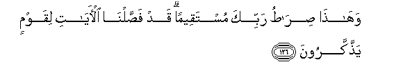

#وَهَٰذَا صِرَاطُ رَبِّكَ مُسْتَقِيمًا ۗ قَدْ فَصَّلْنَا الْآيَاتِ لِقَوْمٍ يَذَّكَّرُونَ

##Wahatha siratu rabbika mustaqeeman qad fassalna alayati liqawmin yaththakkaroona 

## 翻译(Translation)：

| Translator | 译文(Translation)                                            |
| :--------: | ------------------------------------------------------------ |
|    马坚    | 这是你的主的正路。我确已为觉悟的民众而解释一切迹象。         |
|  YUSUFALI  | This is the way of thy Lord leading straight: We have detailed the Signs for those who receive admonition. |
| PICKTHALL  | This is the path of thy Lord, a straight path. We have detailed Our revelations for a people who take heed. |
|   SHAKIR   | And this is the path of your Lord, (a) right (path); indeed We have made the communications clear for a people who mind. |

---

## 对位释义(Words Interpretation)：

| No   | العربية | 中文    | English | 曾用词 |
| ---- | ------: | ------- | ------- | ------ |
| 序号 |    阿文 | Chinese | 英文    | Used   |
| 6:126.1 | وَهَٰذَا    | 和这个   | and this       | 见3:68.7   |
| 6:126.2 | صِرَاطُ    | 道路     | the way        |            |
| 6:126.3 | رَبِّكَ     | 您的主   | Your Lord      | 见2:147.3 |
| 6:126.4 | مُسْتَقِيمًا | 正直的   | the Straight   | 见4:68.3   |
| 6:126.5 | قَدْ      | 当然     | may            | 见2:60.14  |
| 6:126.6 | فَصَّلْنَا   | 我们使   | We have made   | 见6:97.13  |
| 6:126.7 | الْآيَاتِ  | 众迹象   | the signs      | 见2:118.22 |
| 6:126.8 | لِقَوْمٍ    | 对人们   | For the people | 见2:118.23 |
| 6:126.9 | يَذَّكَّرُونَ  | 他们觉悟 | they mind      |            |

---