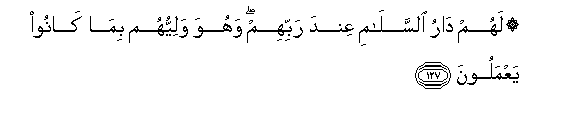

#۞ لَهُمْ دَارُ السَّلَامِ عِنْدَ رَبِّهِمْ ۖ وَهُوَ وَلِيُّهُمْ بِمَا كَانُوا يَعْمَلُونَ

##Lahum daru alssalami AAinda rabbihim wahuwa waliyyuhum bima kanoo yaAAmaloona 

## 翻译(Translation)：

| Translator | 译文(Translation)                                            |
| :--------: | ------------------------------------------------------------ |
|    马坚    | 他们在主那里，将为自己的善行而享受安宅，真主是他们的保佑者。 |
|  YUSUFALI  | For them will be a Home of Peace in the presence of their Lord: He will be their Friend because they practiced (righteousness). |
| PICKTHALL  | For them is the abode of peace with their Lord. He will be their Protecting Friend because of what they used to do. |
|   SHAKIR   | They shall have the abode of peace with their Lord, and He is their guardian because of what they did. |

---

## 对位释义(Words Interpretation)：

| No   | العربية | 中文    | English | 曾用词 |
| ---- | ------: | ------- | ------- | ------ |
| 序号 |    阿文 | Chinese | 英文    | Used   |
| 6:127.1  | لَهُمْ    | 对他们       | for them       | 见2:11.3  |
| 6:127.2  | دَارُ    | 住宅         | the abode      |           |
| 6:127.3  | السَّلَامِ | 平安的       | of peace       | 见5:16.8  |
| 6:127.4  | عِنْدَ    | 以           | with           | 见2:54.20 |
| 6:127.5  | رَبِّهِمْ   | 他们的主     | their Lord     | 见2:5.5   |
| 6:127.6  | وَهُوَ    | 和他         | and he         | 见2:29.16 |
| 6:127.7  | وَلِيُّهُمْ  | 他们的保护者 | their guardian |           |
| 6:127.8  | بِمَا    | 在什么       | in what        | 见2:4.3   |
| 6:127.9  | كَانُوا  | 他们是       | they were      | 见2:10:11 |
| 6:127.10 | يَعْمَلُونَ | 他们的行为   | they do        | 见2:96.25 |

---
