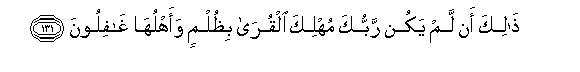

#ذَٰلِكَ أَنْ لَمْ يَكُنْ رَبُّكَ مُهْلِكَ الْقُرَىٰ بِظُلْمٍ وَأَهْلُهَا غَافِلُونَ

##Thalika an lam yakun rabbuka muhlika alqura bithulmin waahluha ghafiloona 

## 翻译(Translation)：

| Translator | 译文(Translation)                                            |
| :--------: | ------------------------------------------------------------ |
|    马坚    | 这是因为你的主在城市的居民昏聩之际，不会因为他们的不义而毁灭城市。 |
|  YUSUFALI  | (The apostles were sent) thus for thy Lord would not destroy for their wrong-doing men's habitations whilst their occupants were unwarned. |
| PICKTHALL  | This is because thy Lord destroyeth not the townships arbitrarily while their people are unconscious (of the wrong they do). |
|   SHAKIR   | This is because your Lord would not destroy towns unjustly while their people were negligent. |

---

## 对位释义(Words Interpretation)：

| No   | العربية | 中文    | English | 曾用词 |
| ---- | ------: | ------- | ------- | ------ |
| 序号 |    阿文 | Chinese | 英文    | Used   |
| 6:131.1  | ذَٰلِكَ    | 这个       | this             | 见2:2.1    |
| 6:131.2  | أَنْ     | 该         | that             | 见2:26.5   |
| 6:131.3  | لَمْ     | 不，没有   | did not          | 见2:6.8    |
| 6:131.4  | يَكُنْ    | 他是       | it is            | 见2:196.62 |
| 6:131.5  | رَبُّكَ    | 您的主     | Your Lord        | 见2:30.3   |
| 6:131.6  | مُهْلِكَ   | 毁灭       | destroy          |            |
| 6:131.7  | الْقُرَىٰ  | 城镇的     | of Cities        | 见6:92.11  |
| 6:131.8  | بِظُلْمٍ   | 在不义     | with wrong       | 见6:82.6   |
| 6:131.9  | وَأَهْلُهَا | 和它的人民 | and whose people | 参4:75.21  |
| 6:131.10 | غَافِلُونَ | 昏聩       | negligent        |            |

---
