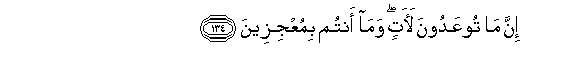

#إِنَّ مَا تُوعَدُونَ لَآتٍ ۖ وَمَا أَنْتُمْ بِمُعْجِزِينَ

##Inna ma tooAAadoona laatin wama antum bimuAAjizeena 

## 翻译(Translation)：

| Translator | 译文(Translation)                                            |
| :--------: | ------------------------------------------------------------ |
|    马坚    | 用来警告你们的事，确是要发生的，你们绝不能逃避天谴。         |
|  YUSUFALI  | All that hath been promised unto you will come to pass: nor can ye frustrate it (in the least bit). |
| PICKTHALL  | Lo! that which ye are promised will surely come to pass, and ye cannot escape. |
|   SHAKIR   | Surely what you are threatened with must come to pass and you cannot escape (it). |

---

## 对位释义(Words Interpretation)：

| No   | العربية | 中文    | English | 曾用词 |
| ---- | ------: | ------- | ------- | ------ |
| 序号 |    阿文 | Chinese | 英文    | Used   |
| 6:134.1 | إِنَّ      | 的确       | surely              | 见2:6.1  |
| 6:134.2 | مَا      | 什么       | what/ that which    | 见2:17.8 |
| 6:134.3 | تُوعَدُونَ  | 你们被许诺 | you are promised    |          |
| 6:134.4 | لَآتٍ     | 必定会发生 | surely come to pass |          |
| 6:134.5 | وَمَا     | 和不       | And not             | 见2:9.9  |
| 6:134.6 | أَنْتُمْ    | 你们       | you                 | 见2:85.2 |
| 6:134.7 | بِمُعْجِزِينَ | 在众逃避者 | in escape           |          |

---
