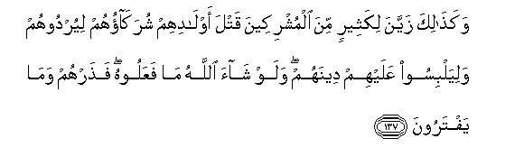

#وَكَذَٰلِكَ زَيَّنَ لِكَثِيرٍ مِنَ الْمُشْرِكِينَ قَتْلَ أَوْلَادِهِمْ شُرَكَاؤُهُمْ لِيُرْدُوهُمْ وَلِيَلْبِسُوا عَلَيْهِمْ دِينَهُمْ ۖ وَلَوْ شَاءَ اللَّهُ مَا فَعَلُوهُ ۖ فَذَرْهُمْ وَمَا يَفْتَرُونَ

##Wakathalika zayyana likatheerin mina almushrikeena qatla awladihim shurakaohum liyurdoohum waliyalbisoo AAalayhim deenahum walaw shaa Allahu ma faAAaloohu fatharhum wama yaftaroona 

## 翻译(Translation)：

| Translator | 译文(Translation)                                            |
| :--------: | ------------------------------------------------------------ |
|    马坚    | 以物配主者的配主，这样诱惑他们中的许多人杀害自己的儿女，以便毁灭他们，并混乱他们的宗教。假若真主意欲，那末，他们就不做这件事，故你当任他们伪造谎言。 |
|  YUSUFALI  | Even so in the eyes of most of the Pagans their 'partners' made alluring the slaughter of their children in order to lead them to their own destruction and cause confusion in their religion. If Allah had willed they would not have done so: but leave alone them and their inventions. |
| PICKTHALL  | Thus have their (so-called) partners (of Allah) made the killing of their children to seem fair unto many of the idolaters, that they may ruin them and make their faith obscure for them. Had Allah willed (it otherwise), they had not done so. So leave them alone with their devices. |
|   SHAKIR   | And thus their associates have made fair seeming to most of the polytheists the killing of their children, that they may cause them to perish and obscure for them their religion; and if Allah had pleased, they would not have done it, therefore leave them and that which they forge. |

---

## 对位释义(Words Interpretation)：

| No   | العربية | 中文    | English | 曾用词 |
| ---- | ------: | ------- | ------- | ------ |
| 序号 |    阿文 | Chinese | 英文    | Used   |
| 6:137.1  | وَكَذَٰلِكَ    | 和像如此         | and Thus                           | 见2:143.1  |
| 6:137.2  | زَيَّنَ      | 他诱惑           | he made alluring                   |            |
| 6:137.3  | لِكَثِيرٍ    | 至很多人         | to most                            | 参4:114.4  |
| 6:137.4  | مِنَ       | 从               | from                               | 见2:4.8    |
| 6:137.5  | الْمُشْرِكِينَ | 以物配主者       | The polytheists                    | 见2:105.9  |
| 6:137.6  | قَتْلَ      | 杀害             | killing                            | 见5:30.4   |
| 6:137.7  | أَوْلَادِهِمْ  | 他们的儿女的     | of their children                  |            |
| 6:137.8  | شُرَكَاؤُهُمْ  | 他们的众配主     | their 'partners'                   | 参6:136.28 |
| 6:137.9  | لِيُرْدُوهُمْ  | 以便他们毁灭他们 | that they may cause them to perish |            |
| 6:137.10 | وَلِيَلْبِسُوا | 和以便他们混淆   | and that they confuse              | 参6:82.4   |
| 6:137.11 | عَلَيْهِمْ    | 在他们           | on they                            | 见1:7.4    |
| 6:137.12 | دِينَهُمْ    | 他们的宗教       | their religion                     | 见4:146.8  |
| 6:137.13 | وَلَوْ      | 和如果           | and if                             | 见2:20.14  |
| 6:137.14 | شَاءَ      | 意欲             | Will                               | 见2:20.15  |
| 6:137.15 | اللَّهُ     | 安拉，真主       | Allah                              | 见2:7.2    |
| 6:137.16 | مَا       | 不               | not                                | 见2:120.24 |
| 6:137.17 | فَعَلُوهُ    | 他们做它         | they would have done it            | 见4:66.13  |
| 6:137.18 | فَذَرْهُمْ    | 因此你使他们     | then you leave them                | 见6:112.21 |
| 6:137.19 | وَمَا      | 和什么           | and that                           | 见2:4.6    |
| 6:137.20 | يَفْتَرُونَ   | 他们虚构         | they have forged                   | 见3:24.15  |

---
