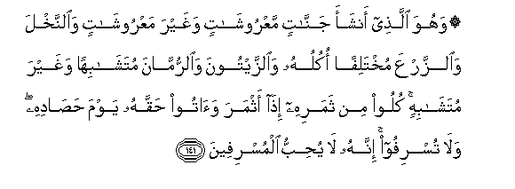

#۞ وَهُوَ الَّذِي أَنْشَأَ جَنَّاتٍ مَعْرُوشَاتٍ وَغَيْرَ مَعْرُوشَاتٍ وَالنَّخْلَ وَالزَّرْعَ مُخْتَلِفًا أُكُلُهُ وَالزَّيْتُونَ وَالرُّمَّانَ مُتَشَابِهًا وَغَيْرَ مُتَشَابِهٍ ۚ كُلُوا مِنْ ثَمَرِهِ إِذَا أَثْمَرَ وَآتُوا حَقَّهُ يَوْمَ حَصَادِهِ ۖ وَلَا تُسْرِفُوا ۚ إِنَّهُ لَا يُحِبُّ الْمُسْرِفِينَ

##Wahuwa allathee anshaa jannatin maAArooshatin waghayra maAArooshatin waalnnakhla waalzzarAAa mukhtalifan okuluhu waalzzaytoona waalrrummana mutashabihan waghayra mutashabihin kuloo min thamarihi itha athmara waatoo haqqahu yawma hasadihi wala tusrifoo innahu la yuhibbu almusrifeena 

## 翻译(Translation)：

| Translator | 译文(Translation)                                            |
| :--------: | ------------------------------------------------------------ |
|    马坚    | 他创造了许多园圃，其中有蔓生的和直立的果木，与果实各别的海枣和百谷，与形同味异的橄榄和石榴。当结果的时候，你们可以采食其果实；在收获的日子，你们当施舍其中的一部分，但不要过分。真主的确不喜爱过分的人。 |
|  YUSUFALI  | It is He who produceth gardens with trellises and without and dates and tilth with produce of all kinds and olives and pomegranates similar (in kind) and different (in variety): eat of their fruit in their season but render the dues that are proper on the day that the harvest is gathered. But waste not by excess: for Allah loveth not the wasters. |
| PICKTHALL  | He it is Who produceth gardens trellised and untrellised, and the date-palm, and crops of divers flavour, and the olive and the pomegranate, like and unlike. Eat ye of the fruit thereof when it fruiteth, and pay the due thereof upon the harvest day, and be not prodigal. Lo! Allah loveth not the prodigals. |
|   SHAKIR   | And He it is Who produces gardens (of vine), trellised and untrellised, and palms and seed-produce of which the fruits are of various sorts, and olives and pomegranates, like and unlike; eat of its fruit when it bears fruit, and pay the due of it on the day of its reaping, and do not act extravagantly; surely He does not love the extravagant. |

---

## 对位释义(Words Interpretation)：

| No   | العربية | 中文    | English | 曾用词 |
| ---- | ------: | ------- | ------- | ------ |
| 序号 |    阿文 | Chinese | 英文    | Used   |
| 6:141.1  | وَهُوَ      | 和他             | and he              | 见2:29.16  |
| 6:141.2  | الَّذِي     | 谁，那些         | those who           | 见2:6.2    |
| 6:141.3  | أَنْشَأَ     | 他创造           | He produces         |            |
| 6:141.4  | جَنَّاتٍ     | 众园圃           | gardens             | 见2:25.8   |
| 6:141.5  | مَعْرُوشَاتٍ  | 蔓生的           | trellised           |            |
| 6:141.6  | وَغَيْرَ     | 和不             | and non             | 见6:99.31  |
| 6:141.7  | مَعْرُوشَاتٍ  | 蔓生的           | trellised           | 见6:141.5  |
| 6:141.8  | وَالنَّخْلَ   | 和海枣           | and palms           |            |
| 6:141.9  | وَالزَّرْعَ   | 和百谷           | and tilth           |            |
| 6:141.10 | مُخْتَلِفًا   | 不同             | divers              |            |
| 6:141.11 | أُكُلُهُ     | 它的果实         | its fruits          |            |
| 6:141.12 | وَالزَّيْتُونَ | 和橄榄           | and the olive       | 见6:99.28  |
| 6:141.13 | وَالرُّمَّانَ  | 和石榴           | and the pomegranate | 见6:99.29  |
| 6:141.14 | مُتَشَابِهًا  | 类似             | Similar             | 见2:25.27  |
| 6:141.15 | وَغَيْرَ     | 和不             | and non             | 见6:99.31  |
| 6:141.16 | مُتَشَابِهٍ   | 相似的           | alike               | 见6:99.32  |
| 6:141.17 | كُلُوا     | 吃               | Eat                 | 见2:57.8   |
| 6:141.18 | مِنْ       | 从               | from                | 见2:4.8    |
| 6:141.19 | ثَمَرِهِ     | 它的果实         | the fruit of it     | 见6:99.35  |
| 6:141.20 | إِذَا      | 当时             | when                | 见2:156.2  |
| 6:141.21 | أَثْمَرَ     | 它结果           | they bear fruit     | 见6:99.37  |
| 6:141.22 | وَآتُوا    | 和你们应给       | and pay             | 见2:43.3   |
| 6:141.23 | حَقَّهُ      | 它的份额         | the due of it       |            |
| 6:141.24 | يَوْمَ      | 日，日子，时候的 | day                 | 见1:4.2    |
| 6:141.25 | حَصَادِهِ    | 它的收获的       | of its reaping      |            |
| 6:141.26 | وَلَا      | 也不             | and not             | 见1:7.8    |
| 6:141.27 | تُسْرِفُوا   | 浪费             | extravagant         |            |
| 6:141.28 | إِنَّهُ      | 确实他           | he is               | 见2:37.8   |
| 6:141.29 | لَا       | 不，不是，没有   | no                  | 见2:2.3    |
| 6:141.30 | يُحِبُّ      | 喜欢             | love                | 见2:190.12 |
| 6:141.31 | الْمُسْرِفِينَ | 众浪费者         | the extravagant     | 参6:141.27 |

---
