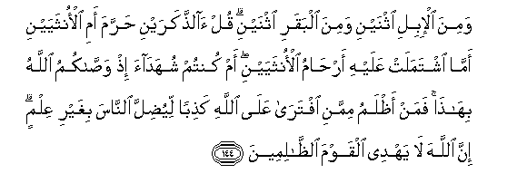

#وَمِنَ الْإِبِلِ اثْنَيْنِ وَمِنَ الْبَقَرِ اثْنَيْنِ ۗ قُلْ آلذَّكَرَيْنِ حَرَّمَ أَمِ الْأُنْثَيَيْنِ أَمَّا اشْتَمَلَتْ عَلَيْهِ أَرْحَامُ الْأُنْثَيَيْنِ ۖ أَمْ كُنْتُمْ شُهَدَاءَ إِذْ وَصَّاكُمُ اللَّهُ بِهَٰذَا ۚ فَمَنْ أَظْلَمُ مِمَّنِ افْتَرَىٰ عَلَى اللَّهِ كَذِبًا لِيُضِلَّ النَّاسَ بِغَيْرِ عِلْمٍ ۗ إِنَّ اللَّهَ لَا يَهْدِي الْقَوْمَ الظَّالِمِينَ

##Wamina alibili ithnayni wamina albaqari ithnayni qul alththakarayni harrama ami alonthayayni amma ishtamalat AAalayhi arhamu alonthayayni am kuntum shuhadaa ith wassakumu Allahu bihatha faman athlamu mimmani iftara AAala Allahi kathiban liyudilla alnnasa bighayri AAilmin inna Allaha la yahdee alqawma alththalimeena 

## 翻译(Translation)：

| Translator | 译文(Translation)                                            |
| :--------: | ------------------------------------------------------------ |
|    马坚    | 两只骆驼和两只黄牛。你说：真主只以两只公的为禁物呢？还是只以两只母的为禁物呢？还是只以两只母的所孕育的为禁物呢？难道真主以此嘱咐你们的时候，你们会作见证吗？假借真主的名义而造谣，以致无知地使人迷误的人，有谁比他还不义呢？真主必定不引导不义的民众。 |
|  YUSUFALI  | Of camels a pair and of oxen a pair; say hath He forbidden the two males or the two females or the (the young) which the wombs of the two females enclose? Were ye present when Allah ordered you such a thing? But who doth more wrong than one who invents a lie against Allah to lead astray men without knowledge? For Allah guideth not people who do wrong. |
| PICKTHALL  | And of the camels twain and of the oxen twain. Say: Hath He forbidden the two males or the two females, or that which the wombs of the two females contain; or were ye by to witness when Allah commanded you (all) this ? Then who doth greater wrong than he who deviseth a lie concerning Allah, that he may lead mankind astray without knowledge. Lo! Allah guideth not wrongdoing folk. |
|   SHAKIR   | And two of camels and two of cows. Say: Has He forbidden the two males or the two females or that which the wombs of the two females contain? Or were you witnesses when Allah enjoined you this? Who, then, is more unjust than he who forges a lie against Allah that he should lead astray men without knowledge? Surely Allah does not guide the unjust people. |

---

## 对位释义(Words Interpretation)：

| No   | العربية | 中文    | English | 曾用词 |
| ---- | ------: | ------- | ------- | ------ |
| 序号 |    阿文 | Chinese | 英文    | Used   |
| 6:144.1  | وَمِنَ      | 和从           | And from                   | 见2:8.1    |
| 6:144.2  | الْإِبِلِ    | 众骆驼         | the camels                 |            |
| 6:144.3  | اثْنَيْنِ    | 两只           | two                        | 见6:143.5  |
| 6:144.4  | وَمِنَ      | 和从           | And from                   | 见2:8.1    |
| 6:144.5  | الْبَقَرِ    | 众牛           | the oxen                   |            |
| 6:144.6  | اثْنَيْنِ    | 两只           | two                        | 见6:143.5  |
| 6:144.7  | قُلْ       | 你说           | Say                        | 见2:80.8   |
| 6:144.8  | آلذَّكَرَيْنِ  | 两只公的       | the two males              | 见6:143.10 |
| 6:144.9  | حَرَّمَ      | 禁止           | forbidden                  | 见2:173.2  |
| 6:144.10 | أَمِ       | 或             | or                         | 见2:140.16 |
| 6:144.11 | الْأُنْثَيَيْنِ | 两个女子的     | of two females             | 见4:11.8   |
| 6:144.12 | أَمَّا      | 或者什么       | or that                    | 见6:143.14 |
| 6:144.13 | اشْتَمَلَتْ   | 它包含         | contain                    | 见6:143.15 |
| 6:144.14 | عَلَيْهِ     | 在他           | on him                     | 见2:37.7   |
| 6:144.15 | أَرْحَامُ    | 众子宫         | the wombs                  | 见6:143.17 |
| 6:144.16 | الْأُنْثَيَيْنِ | 两个女子的     | of two females             | 见4:11.8   |
| 6:144.17 | أَمْ       | 或             | or                         | 见2:6.7    |
| 6:144.18 | كُنْتُمْ     | 你们是         | You are                    | 见2:23.2   |
| 6:144.19 | شُهَدَاءَ    | 见证           | Witness                    | 见2:133.3  |
| 6:144.20 | إِذْ       | 当时           | when                       | 见2:131.1  |
| 6:144.21 | وَصَّاكُمُ    | 他命令你们     | ordered you                |            |
| 6:144.22 | اللَّهُ     | 安拉，真主     | Allah                      | 见2:7.2    |
| 6:144.23 | بِهَٰذَا     | 在这个         | by this                    | 见2:26.27  |
| 6:144.24 | فَمَنْ      | 无论谁         | whosoever                  | 见2:38.9   |
| 6:144.25 | أَظْلَمُ     | 更不义         | more unjust                | 见2:114.2  |
| 6:144.26 | مِمَّنِ      | 比谁           | than who                   | 见6:21.3   |
| 6:144.27 | افْتَرَىٰ    | 他假借         | he invents                 | 见3:94.2   |
| 6:144.28 | عَلَى      | 至             | On                         | 见2:5.2    |
| 6:144.29 | اللَّهِ     | 真主的         | of Allah                   | 见2:23.17  |
| 6:144.30 | كَذِبًا     | 一个谎言       | a lie                      | 见6:21.7   |
| 6:144.31 | لِيُضِلَّ     | 以便他迷误     | that he should lead astray |            |
| 6:144.32 | النَّاسَ    | 人             | People                     | 见2:8.2    |
| 6:144.33 | بِغَيْرِ     | 在没有         | without                    | 见2:61.54  |
| 6:144.34 | عِلْمٍ      | 知识           | knowledge                  | 见4:157.28 |
| 6:144.35 | إِنَّ       | 的确           | surely                     | 见2:6.1    |
| 6:144.36 | اللَّهَ     | 安拉，真主     | Allah                      | 见2:9.2    |
| 6:144.37 | لَا       | 不，不是，没有 | no                         | 见2:2.3    |
| 6:144.38 | يَهْدِي     | 他引导         | he guides                  | 见2:142.16 |
| 6:144.39 | الْقَوْمَ    | 人们           | folk                       | 见2:250.14 |
| 6:144.40 | الظَّالِمِينَ | 不义的人       | unjust                     | 见2:35.19  |

---
