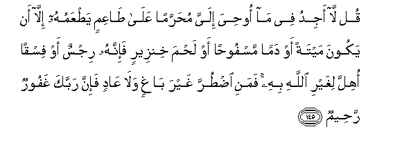

#قُلْ لَا أَجِدُ فِي مَا أُوحِيَ إِلَيَّ مُحَرَّمًا عَلَىٰ طَاعِمٍ يَطْعَمُهُ إِلَّا أَنْ يَكُونَ مَيْتَةً أَوْ دَمًا مَسْفُوحًا أَوْ لَحْمَ خِنْزِيرٍ فَإِنَّهُ رِجْسٌ أَوْ فِسْقًا أُهِلَّ لِغَيْرِ اللَّهِ بِهِ ۚ فَمَنِ اضْطُرَّ غَيْرَ بَاغٍ وَلَا عَادٍ فَإِنَّ رَبَّكَ غَفُورٌ رَحِيمٌ

##Qul la ajidu fee ma oohiya ilayya muharraman AAala taAAimin yatAAamuhu illa an yakoona maytatan aw daman masfoohan aw lahma khinzeerin fainnahu rijsun aw fisqan ohilla lighayri Allahi bihi famani idturra ghayra baghin wala AAadin fainna rabbaka ghafoorun raheemun 

## 翻译(Translation)：

| Translator | 译文(Translation)                                            |
| :--------: | ------------------------------------------------------------ |
|    马坚    | 你说：在我所受的启示里，我不能发现任何人所不得吃的食物；除非是自死物，或流出的血液，或猪肉--因为它们确是不洁的--或是诵非真主之名而宰的犯罪物。凡为势所迫，非出自愿，且不过分的人，（虽吃禁物，毫无罪过），因为你的主确是至赦的，确是至慈的。 |
|  YUSUFALI  | Say: "I find not in the Message received by me by inspiration any (meat) forbidden to be eaten by one who wishes to eat it unless it be dead meat or blood poured forth or the flesh of swine for it is an abomination or what is impious (meat) on which a name has been invoked other than Allah's." But (even so) if a person is forced by necessity without wilful disobedience nor transgressing due limits thy Lord is Oft-Forgiving Most Merciful. |
| PICKTHALL  | Say: I find not in that which is revealed unto me aught prohibited to an eater that he eat thereof, except it be carrion, or blood poured forth, or swineflesh - for that verily is foul - or the abomination which was immolated to the name of other than Allah. But whoso is compelled (thereto), neither craving nor transgressing, (for him) lo! thy Lord is Forgiving, Merciful. |
|   SHAKIR   | Say: I do not find in that which has been revealed to me anything forbidden for an eater to eat of except that it be what has died of itself, or blood poured forth, or flesh of swine-- for that surely is unclean-- or that which is a transgression, other than (the name of) Allah having been invoked on it; but whoever is driven to necessity, not desiring nor exceeding the limit, then surely your Lord is Forgiving, Merciful. |

---

## 对位释义(Words Interpretation)：

| No   | العربية | 中文    | English | 曾用词 |
| ---- | ------: | ------- | ------- | ------ |
| 序号 |    阿文 | Chinese | 英文    | Used   |
| 6:145.1  | قُلْ     | 你说                     | Say                  | 见2:80.8   |
| 6:145.2  | لَا     | 不，不是，没有           | no                   | 见2:2.3    |
| 6:145.3  | أَجِدُ    | 我发现                   | I find               |            |
| 6:145.4  | فِي     | 在                       | in                   | 见2:10.1   |
| 6:145.5  | مَا     | 什么                     | what/ that which     | 见2:17.8   |
| 6:145.6  | أُوحِيَ   | 它启示                   | It has been revealed | 见6:93.10  |
| 6:145.7  | إِلَيَّ    | 至我                     | to me                | 见3:55.9   |
| 6:145.8  | مُحَرَّمًا  | 禁止                     | forbidden            |            |
| 6:145.9  | عَلَىٰ    | 至                       | On                   | 见2:5.2    |
| 6:145.10 | طَاعِمٍ   | 一个吃者                 | an eater             |            |
| 6:145.11 | يَطْعَمُهُ  | 他吃它                   | he eat it            |            |
| 6:145.12 | إِلَّا    | 除了                     | Except               | 见2:9.7    |
| 6:145.13 | أَنْ     | 该                       | that                 | 见2:26.5   |
| 6:145.14 | يَكُونَ   | 他是                     | he is                | 见2:150.16 |
| 6:145.15 | مَيْتَةً   | 死的                     | dead                 | 见6:139.14 |
| 6:145.16 | أَوْ     | 或                       | or                   | 见2:19.1   |
| 6:145.17 | دَمًا    | 血液                     | blood                |            |
| 6:145.18 | مَسْفُوحًا | 流出的                   | poured forth         |            |
| 6:145.19 | أَوْ     | 或                       | or                   | 见2:19.1   |
| 6:145.20 | لَحْمَ    | 肉                       | flesh                |            |
| 6:145.21 | خِنْزِيرٍ  | 猪的                     | of swine             |            |
| 6:145.22 | فَإِنَّهُ   | 因此确实他               | for surely he        | 见2:97.6   |
| 6:145.23 | رِجْسٌ    | 不洁净                   | an uncleanness | 见5:90.10  |
| 6:145.24 | أَوْ     | 或                       | or                   | 见2:19.1   |
| 6:145.25 | فِسْقًا   | 可憎的                   | transgressing        |            |
| 6:145.26 | أُهِلَّ    | 牠被诵                   | has been invoked     | 见2:173.9  |
| 6:145.27 | لِغَيْرِ   | 以不                     | for non              | 见2:173.11 |
| 6:145.28 | اللَّهِ   | 真主的                   | of Allah             | 见2:23.17  |
| 6:145.29 | بِهِ     | 以它                     | with it              | 见2:22.13  |
| 6:145.30 | فَمَنِ    | 然后谁                   | then who             | 见2:173.13 |
| 6:145.31 | اضْطُرَّ   | 他被迫                   | be forced            | 见2:173.14 |
| 6:145.32 | غَيْرَ    | 非，除了，除开，不是，但 | non, but             | 见1:7.5    |
| 6:145.33 | بَاغٍ    | 自愿                     | desiring             | 见2:173.16 |
| 6:145.34 | وَلَا    | 也不                     | and not              | 见1:7.8    |
| 6:145.35 | عَادٍ    | 过分的                   | transgressing        | 见2:173.18 |
| 6:145.36 | فَإِنَّ    | 因此确实                 | so surely            | 见2:61.34  |
| 6:145.37 | رَبَّكَ    | 您的主                   | Your Lord            | 见2:30.3   |
| 6:145.38 | غَفُورٌ   | 至赦的                   | Forgiving            | 见2:173.24 |
| 6:145.39 | رَحِيمٌ   | 至慈的                   | Merciful             | 见2:143.45 |

---
