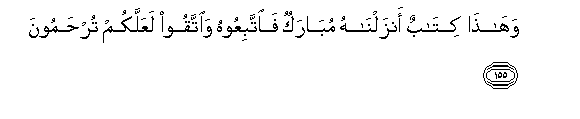

#وَهَٰذَا كِتَابٌ أَنْزَلْنَاهُ مُبَارَكٌ فَاتَّبِعُوهُ وَاتَّقُوا لَعَلَّكُمْ تُرْحَمُونَ

##Wahatha kitabun anzalnahu mubarakun faittabiAAoohu waittaqoo laAAallakum turhamoona 

## 翻译(Translation)：

| Translator | 译文(Translation)                                            |
| :--------: | ------------------------------------------------------------ |
|    马坚    | 这是我所降示的、吉祥的经典，故你们当遵守它，并当敬畏主，以便你们蒙主的怜悯。 |
|  YUSUFALI  | And this is a Book which We have revealed as a blessing: so follow it and be righteous that ye may receive mercy: |
| PICKTHALL  | And this is a blessed Scripture which We have revealed. So follow it and ward off (evil), that ye may find mercy. |
|   SHAKIR   | And this is a Book We have revealed, blessed; therefore follow it and guard (against evil) that mercy may be shown to you. |

---

## 对位释义(Words Interpretation)：

| No   | العربية | 中文    | English | 曾用词 |
| ---- | ------: | ------- | ------- | ------ |
| 序号 |    阿文 | Chinese | 英文    | Used   |
| 6:155.1 | وَهَٰذَا    | 和这个           | and this        | 见3:68.7  |
| 6:155.2 | كِتَابٌ    | 经典             | a book          | 见2:89.3  |
| 6:155.3 | أَنْزَلْنَاهُ | 我们降下它       | we sent down it | 见6:92.3  |
| 6:155.4 | مُبَارَكٌ   | 吉祥的           | blessed         | 见6:92.4  |
| 6:155.5 | فَاتَّبِعُوهُ | 因此你们应遵循它 | so follow it    | 见6:153.5 |
| 6:155.6 | وَاتَّقُوا  | 和畏惧           | And fear        | 见2:48.1  |
| 6:155.7 | لَعَلَّكُمْ   | 以便你们         | you may         | 见2:21.11 |
| 6:155.8 | تُرْحَمُونَ  | 蒙怜恤           | obtain mercy    | 见3:132.5 |

---