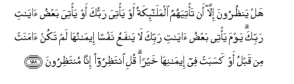

#هَلْ يَنْظُرُونَ إِلَّا أَنْ تَأْتِيَهُمُ الْمَلَائِكَةُ أَوْ يَأْتِيَ رَبُّكَ أَوْ يَأْتِيَ بَعْضُ آيَاتِ رَبِّكَ ۗ يَوْمَ يَأْتِي بَعْضُ آيَاتِ رَبِّكَ لَا يَنْفَعُ نَفْسًا إِيمَانُهَا لَمْ تَكُنْ آمَنَتْ مِنْ قَبْلُ أَوْ كَسَبَتْ فِي إِيمَانِهَا خَيْرًا ۗ قُلِ انْتَظِرُوا إِنَّا مُنْتَظِرُونَ

##Hal yanthuroona illa an tatiyahumu almalaikatu aw yatiya rabbuka aw yatiya baAAdu ayati rabbika yawma yatee baAAdu ayati rabbika la yanfaAAu nafsan eemanuha lam takun amanat min qablu aw kasabat fee eemaniha khayran quli intathiroo inna muntathiroona 

## 翻译(Translation)：

| Translator | 译文(Translation)                                            |
| :--------: | ------------------------------------------------------------ |
|    马坚    | 他们只有等待众天神的降临，只有等待你的主（的刑罚）来临，或你的主的一部分迹象的降临。你的主的一部分迹象降临之日，凡以前未曾信道，或虽信道而未行善的人，在那日，即使信道，也无益了。你说：你们等待吧！我们确是等待的。 |
|  YUSUFALI  | Are they waiting to see if the angels come to them or thy Lord (Himself) or certain of the signs of thy Lord! the day that certain of the signs of thy Lord do come no good will it do to a soul to believe in them then if it believed not before nor earned righteousness through its Faith. Say: "Wait ye: we too are waiting." |
| PICKTHALL  | Wait they, indeed, for nothing less than that the angels should come unto them, or thy Lord should come, or there should come one of the portents from thy Lord ? In the day when one of the portents from thy Lord cometh, its belief availeth naught a soul which theretofore believed not, nor in its belief earned good (by works). Say: Wait ye! Lo! We (too) are waiting. |
|   SHAKIR   | They do not wait aught but that the angels should come to them, or that your Lord should come, or that some of the signs of your Lord should come. On the day when some of the signs of your Lord shall come, its faith shall not profit a soul which did not believe before, or earn good through its faith. Say: Wait; we too are waiting. |

---

## 对位释义(Words Interpretation)：

| No   | العربية | 中文    | English | 曾用词 |
| ---- | ------: | ------- | ------- | ------ |
| 序号 |    阿文 | Chinese | 英文    | Used   |
| 6:158.1  | هَلْ       | 是吗？           | will ?           | 见2:210.1  |
| 6:158.2  | يَنْظُرُونَ   | 他们等待         | they wait        | 见2:210.2  |
| 6:158.3  | إِلَّا      | 除了             | Except           | 见2:9.7    |
| 6:158.4  | أَنْ       | 该               | that             | 见2:26.5   |
| 6:158.5  | تَأْتِيَهُمُ   | 她来至他们       | she come to them | 参2:210.5  |
| 6:158.6  | الْمَلَائِكَةُ | 天使             | the angels       | 见2:248.22 |
| 6:158.7  | أَوْ       | 或               | or               | 见2:19.1   |
| 6:158.8  | يَأْتِيَ     | 带来             | bring            | 见2:109.25 |
| 6:158.9  | رَبُّكَ      | 您的主           | Your Lord        | 见2:30.3   |
| 6:158.10 | أَوْ       | 或               | or               | 见2:19.1   |
| 6:158.11 | يَأْتِيَ     | 带来             | bring            | 见2:109.25 |
| 6:158.12 | بَعْضُ      | 部分             | some             |            |
| 6:158.13 | آيَاتِ     | 迹象             | Signs            | 见2:231.23 |
| 6:158.14 | رَبِّكَ      | 您的主           | Your Lord        | 见2:147.3  |
| 6:158.15 | يَوْمَ      | 日，日子，时候的 | day              | 见1:4.2    |
| 6:158.16 | يَأْتِي     | 他使             | he causes        | 见2:258.28 |
| 6:158.17 | بَعْضُ      | 部分             | some             | 见6:158.12 |
| 6:158.18 | آيَاتِ     | 迹象             | Signs            | 见2:231.23 |
| 6:158.19 | رَبِّكَ      | 您的主           | Your Lord        | 见2:147.3  |
| 6:158.20 | لَا       | 不，不是，没有   | no               | 见2:2.3    |
| 6:158.21 | يَنْفَعُ     | 有利             | profits          | 见2:164.15 |
| 6:158.22 | نَفْسًا     | 一个男人         | a man            | 见2:72.3   |
| 6:158.23 | إِيمَانُهَا  | 她的信道         | its belief       |            |
| 6:158.24 | لَمْ       | 不，没有         | did not          | 见2:6.8    |
| 6:158.25 | تَكُنْ      | 是               | be               | 见3:60.5   |
| 6:158.26 | آمَنَتْ     | 她信仰           | she believed     |            |
| 6:158.27 | مِنْ       | 从               | from             | 见2:4.8    |
| 6:158.28 | قَبْلُ      | 以前             | Before           | 见2:25.24  |
| 6:158.29 | أَوْ       | 或               | or               | 见2:19.1   |
| 6:158.30 | كَسَبَتْ     | 赚到             | earned           | 见2:134.7  |
| 6:158.31 | فِي       | 在               | in               | 见2:10.1   |
| 6:158.32 | إِيمَانِهَا  | 她的信道         | its belief       | 参6:158.23 |
| 6:158.33 | خَيْرًا     | 好的             | Good             | 见2:158.20 |
| 6:158.34 | قُلِ       | 你说             | Say              | 见2:219.30 |
| 6:158.35 | انْتَظِرُوا  | 你们等待         | Wait you         |            |
| 6:158.36 | إِنَّا      | 确实我们         | surely we        | 见2:14.12  |
| 6:158.37 | مُنْتَظِرُونَ  | 等待的           | waiting          | 参6:158.35 |

---