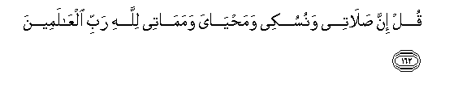

#قُلْ إِنَّ صَلَاتِي وَنُسُكِي وَمَحْيَايَ وَمَمَاتِي لِلَّهِ رَبِّ الْعَالَمِينَ

##Qul inna salatee wanusukee wamahyaya wamamatee lillahi rabbi alAAalameena 

## 翻译(Translation)：

| Translator | 译文(Translation)                                            |
| :--------: | ------------------------------------------------------------ |
|    马坚    | 你说：我的礼拜，我的牺牲，我的生活，我的死亡，的确都是为真主--全世界的主。 |
|  YUSUFALI  | Say: "Truly my prayer and my service of sacrifice my life and my death are (all) for Allah the Cherisher of the Worlds: |
| PICKTHALL  | Say: Lo! my worship and my sacrifice and my living and my dying are for Allah, Lord of the Worlds. |
|   SHAKIR   | Say. Surely my prayer and my sacrifice and my life and my death are (all) for Allah, the Lord of the worlds; |

---

## 对位释义(Words Interpretation)：

| No   | العربية | 中文    | English | 曾用词 |
| ---- | ------: | ------- | ------- | ------ |
| 序号 |    阿文 | Chinese | 英文    | Used   |
| 6:162.1 | قُلْ       | 你说           | Say              | 见2:80.8 |
| 6:162.2 | إِنَّ       | 的确           | surely           | 见2:6.1  |
| 6:162.3 | صَلَاتِي    | 我的礼拜       | my prayer        |          |
| 6:162.4 | وَنُسُكِي    | 和我的牺牲     | and my sacrifice |          |
| 6:162.5 | وَمَحْيَايَ   | 和我的生活     | and my life      |          |
| 6:162.6 | وَمَمَاتِي   | 和我的死亡     | and my death     |          |
| 6:162.7 | لِلَّهِ      | 为真主         | for Allah        | 见1:2.2  |
| 6:162.8 | رَبِّ       | 主，养育，调养 | Lord             | 见1:2.3  |
| 6:162.9 | الْعَالَمِينَ | 世界，众世界的 | worlds           | 见1:2.4  |

---