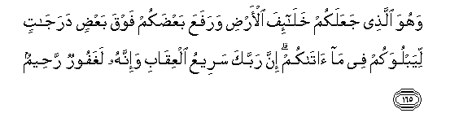

#وَهُوَ الَّذِي جَعَلَكُمْ خَلَائِفَ الْأَرْضِ وَرَفَعَ بَعْضَكُمْ فَوْقَ بَعْضٍ دَرَجَاتٍ لِيَبْلُوَكُمْ فِي مَا آتَاكُمْ ۗ إِنَّ رَبَّكَ سَرِيعُ الْعِقَابِ وَإِنَّهُ لَغَفُورٌ رَحِيمٌ

##Wahuwa allathee jaAAalakum khalaifa alardi warafaAAa baAAdakum fawqa baAAdin darajatin liyabluwakum fee ma atakum inna rabbaka sareeAAu alAAiqabi wainnahu laghafoorun raheemun 

## 翻译(Translation)：

| Translator | 译文(Translation)                                            |
| :--------: | ------------------------------------------------------------ |
|    马坚    | 他以你们为大地的代治者，并使你们中的一部分人超越另一部分人若干级，以便他考验你们如何享受他赏赐你们的恩典。你的主确是刑罚神速的，他确是至赦的，确是至慈的。 |
|  YUSUFALI  | It is He who hath made you (His) agents inheritors of the earth: He hath raised you in ranks some above others: that he may try you in the gifts He hath given you: for thy Lord is quick in punishment: yet He is indeed Oft-Forgiving Most Merciful. |
| PICKTHALL  | He it is Who hath placed you as viceroys of the earth and hath exalted some of you in rank above others, that He may try you by (the test of) that which He hath given you. Lo! Thy Lord is swift in prosecution, and Lo! He verily is Forgiving, Merciful. |
|   SHAKIR   | And He it is Who has made you successors in the land and raised some of you above others by (various) grades, that He might try you by what He has given you; surely your Lord is quick to requite (evil), and He is most surely the Forgiving, the Merciful. |

---

## 对位释义(Words Interpretation)：

| No   | العربية | 中文    | English | 曾用词 |
| ---- | ------: | ------- | ------- | ------ |
| 序号 |    阿文 | Chinese | 英文    | Used   |
| 6:165.1  | وَهُوَ     | 和他           | and he             | 见2:29.16  |
| 6:165.2  | الَّذِي    | 谁             | who                | 见2:17.3   |
| 6:165.3  | جَعَلَكُمْ   | 他使你们       | he has made you    |            |
| 6:165.4  | خَلَائِفَ   | 众代治者       | agents inheritors  |            |
| 6:165.5  | الْأَرْضِ   | 大地           | Earth              | 见2:22.4   |
| 6:165.6  | وَرَفَعَ    | 提升           | raised             | 见2:253.11 |
| 6:165.7  | بَعْضَكُمْ   | 你们的一部分   | some of you        | 见4:32.7   |
| 6:165.8  | فَوْقَ     | 之上           | above              | 见3:55.17  |
| 6:165.9  | بَعْضٍ     | 一部分         | Some               | 见2:76.11  |
| 6:165.10 | دَرَجَاتٍ   | 等级           | degree             | 见2:253.13 |
| 6:165.11 | لِيَبْلُوَكُمْ | 为了他考验你们 | for He may try you | 见5:48.37  |
| 6:165.12 | فِي      | 在             | in                 | 见2:10.1   |
| 6:165.13 | مَا      | 什么           | what/ that which   | 见2:17.8   |
| 6:165.14 | آتَاكُمْ   | 他给你们       | He gave you        | 见5:48.40  |
| 6:165.15 | إِنَّ      | 的确           | surely             | 见2:6.1    |
| 6:165.16 | رَبَّكَ     | 您的主         | Your Lord          | 见2:30.3   |
| 6:165.17 | سَرِيعُ    | 神速           | swift in           | 见2:202.7  |
| 6:165.18 | الْعِقَابِ  | 刑罚           | punishment         | 见2:196.73 |
| 6:165.19 | وَإِنَّهُ    | 和确实他       | and he is          | 见2:130.14 |
| 6:165.20 | لَغَفُورٌ   | 必定至赦的     | surely forgiving   | 参2:173.24 |
| 6:165.21 | رَحِيمٌ    | 至慈的         | Merciful           | 见2:143.45 |

---