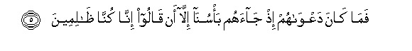

# فَمَا كَانَ دَعْوَاهُمْ إِذْ جَاءَهُمْ بَأْسُنَا إِلَّا أَنْ قَالُوا إِنَّا كُنَّا ظَالِمِينَ 

##Fama kana daAAwahum ith jaahum ba/suna illa an qaloo inna kunna thalimeena 

## 翻译(Translation)：

| Translator | 译文(Translation)                                            |
| :--------: | ------------------------------------------------------------ |
|    马坚    | 当我的刑罚降临他们的时候，他们唯一的辩诉是说：我们原来确是不义的。 |
|  YUSUFALI  | When (thus) Our punishment took them, no cry did they utter but this: "Indeed we did wrong." |
| PICKTHALL  | No plea had they, when Our terror came unto them, save that they said: Lo! We were wrong-doers. |
|   SHAKIR   | Yet their cry, when Our punishment came to them, was nothing but that they said: Surely we were unjust. |

---

## 对位释义(Words Interpretation)：

| No   | العربية | 中文    | English | 曾用词 |
| ---- | ------: | ------- | ------- | ------ |
| 序号 |    阿文 | Chinese | 英文    | Used   |
| 7:5.1  | فَمَا    | 什么，并未 | What               | 见2:16.6  |
| 7:5.2  | كَانَ    | 他是       | It was             | 见2:75.6  |
| 7:5.3  | دَعْوَاهُمْ | 他们的辩诉 | their cry          |           |
| 7:5.4  | إِذْ     | 当时       | when               | 见2:131.1 |
| 7:5.5  | جَاءَهُمْ  | 他来到他们 | there came to them | 见2:89.2  |
| 7:5.6  | بَأْسُنَا  | 我们的惩罚 | Our punishment     | 见6:43.4  |
| 7:5.7  | إِلَّا    | 除了       | Except             | 见2:9.7   |
| 7:5.8  | أَنْ     | 该         | that               | 见2:26.5  |
| 7:5.9  | قَالُوا  | 他们说，   | They said          | 见2:11.8  |
| 7:5.10 | إِنَّا    | 确实我们   | surely we          | 见2:14.12 |
| 7:5.11 | كُنَّا    | 我们是     | We were            | 见4:97.11 |
| 7:5.12 | ظَالِمِينَ | 众不义者   | unjust             |           |

---