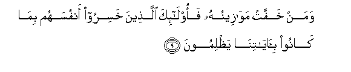

# وَمَنْ خَفَّتْ مَوَازِينُهُ فَأُولَٰئِكَ الَّذِينَ خَسِرُوا أَنْفُسَهُمْ بِمَا كَانُوا بِآيَاتِنَا يَظْلِمُونَ 

##Waman khaffat mawazeenuhu faola-ika allatheena khasiroo anfusahum bima kanoo bi-ayatina yathlimoona 

## 翻译(Translation)：

| Translator | 译文(Translation)                                            |
| :--------: | ------------------------------------------------------------ |
|    马坚    | 善功的分量较轻的人，将因生前不信我的迹象而亏折自身。         |
|  YUSUFALI  | Those whose scale will be light, will be their souls in perdition, for that they wrongfully treated Our signs. |
| PICKTHALL  | And as for those whose scale is light: those are they who lose their souls because they used to wrong Our revelations. |
|   SHAKIR   | And as for him whose measure (of good deeds) is light those are they who have made their souls suffer loss because they disbelieved in Our communications. |

---

## 对位释义(Words Interpretation)：

| No   | العربية | 中文    | English | 曾用词 |
| ---- | ------: | ------- | ------- | ------ |
| 序号 |    阿文 | Chinese | 英文    | Used   |
| 7:9.1  | وَمَنْ     | 和谁         | and who          | 见2:108.11 |
| 7:9.2  | خَفَّتْ     | 它轻         | it is light      |            |
| 7:9.3  | مَوَازِينُهُ | 他的天秤     | his scale        | 见7:8.6    |
| 7:9.4  | فَأُولَٰئِكَ  | 然后那些人   | then those       | 见2:81.8   |
| 7:9.5  | الَّذِينَ   | 谁，那些     | those who        | 见2:6.2    |
| 7:9.6  | خَسِرُوا   | 他们亏折     | they have lost   | 见6:12.21  |
| 7:9.7  | أَنْفُسَهُمْ  | 他们自己     | themselves       | 见2:9.8    |
| 7:9.8  | بِمَا     | 在什么       | in what          | 见2:4.3    |
| 7:9.9  | كَانُوا   | 他们是       | they were        | 见2:10:11  |
| 7:9.10 | بِآيَاتِنَا | 在我们的迹象 | in Our signs     | 见2:39.4   |
| 7:9.11 | يَظْلِمُونَ  | 他们欺骗     | They are wronged | 见2:57.18  |

---