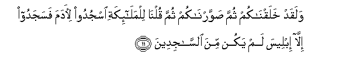

# وَلَقَدْ خَلَقْنَاكُمْ ثُمَّ صَوَّرْنَاكُمْ ثُمَّ قُلْنَا لِلْمَلَائِكَةِ اسْجُدُوا لِآدَمَ فَسَجَدُوا إِلَّا إِبْلِيسَ لَمْ يَكُنْ مِنَ السَّاجِدِينَ 

##Walaqad khalaqnakum thumma sawwarnakum thumma qulna lilmala-ikati osjudoo li-adama fasajadoo illa ibleesa lam yakun mina alssajideena 

## 翻译(Translation)：

| Translator | 译文(Translation)                                            |
| :--------: | ------------------------------------------------------------ |
|    马坚    | 我确已创造你们，然后使你们成形，然后对众天神说：你们向阿丹叩头。他们就向他叩头，唯独易卜劣厮没有叩头。 |
|  YUSUFALI  | It is We Who created you and gave you shape; then We bade the angels prostrate to Adam, and they prostrate; not so Iblis; He refused to be of those who prostrate. |
| PICKTHALL  | And We created you, then fashioned you, then told the angels: Fall ye prostrate before Adam! And they fell prostrate, all save Iblis, who was not of those who make prostration. |
|   SHAKIR   | And certainly We created you, then We fashioned you, then We said to the angels: Prostrate to Adam. So they did prostrate except Iblis; he was not of those who prostrated. |

---

## 对位释义(Words Interpretation)：

| No   | العربية | 中文    | English | 曾用词 |
| ---- | ------: | ------- | ------- | ------ |
| 序号 |    阿文 | Chinese | 英文    | Used   |
| 7:11.1  | وَلَقَدْ     | 和确实         | And certainly       | 见2:65.1   |
| 7:11.2  | خَلَقْنَاكُمْ  | 我们创造你们   | We created you      | 见6:94.5   |
| 7:11.3  | ثُمَّ       | 然后           | Then                | 见2:28.7   |
| 7:11.4  | صَوَّرْنَاكُمْ  | 我们使你们成形 | We fashioned you    |            |
| 7:11.5  | ثُمَّ       | 然后           | Then                | 见2:28.7   |
| 7:11.6  | قُلْنَا     | 我们说         | We said             | 见2:34.2   |
| 7:11.7  | لِلْمَلَائِكَةِ | 对众天使       | to the angels       | 见2:30.4   |
| 7:11.8  | اسْجُدُوا   | 扣头，拜倒     | Prostrate           | 见2:34.4   |
| 7:11.9  | لِآدَمَ     | 阿丹           | to Adam             | 见2:34.5   |
| 7:11.10 | فَسَجَدُوا   | 因此扣头       | then Prostrate      | 见2:34.6   |
| 7:11.11 | إِلَّا      | 除了           | Except              | 见2:9.7    |
| 7:11.12 | إِبْلِيسَ    | 易卜劣厮       | Iblis, Satan        | 见2:34.8   |
| 7:11.13 | لَمْ       | 不，没有       | did not             | 见2:6.8    |
| 7:11.14 | يَكُنْ      | 他是           | it is               | 见2:196.62 |
| 7:11.15 | مِنَ       | 从             | from                | 见2:19.3 |
| 7:11.16 | السَّاجِدِينَ | 扣头者         | those who prostrate |            |

---