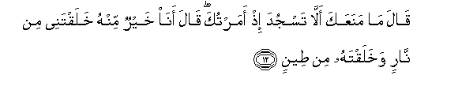

# قَالَ مَا مَنَعَكَ أَلَّا تَسْجُدَ إِذْ أَمَرْتُكَ ۖ قَالَ أَنَا خَيْرٌ مِنْهُ خَلَقْتَنِي مِنْ نَارٍ وَخَلَقْتَهُ مِنْ طِينٍ 

##Qala ma manaAAaka alla tasjuda ith amartuka qala ana khayrun minhu khalaqtanee min narin wakhalaqtahu min teenin 

## 翻译(Translation)：

| Translator | 译文(Translation)                                            |
| :--------: | ------------------------------------------------------------ |
|    马坚    | 主说：当我命令你叩头的时候，你为什么不叩头呢？他说：我比他优越，你用火造我，用泥造他。 |
|  YUSUFALI  | (Allah) said: "What prevented thee from prostrating when I commanded thee?" He said: "I am better than he: Thou didst create me from fire, and him from clay." |
| PICKTHALL  | He said: What hindered thee that thou didst not fall prostrate when I bade thee? (Iblis) said: I am better than him. Thou createdst me of fire while him Thou didst create of mud. |
|   SHAKIR   | He said: What hindered you so that you did not prostrate when I commanded you? He said: I am better than he: Thou hast created me of fire, while him Thou didst create of dust. |

---

## 对位释义(Words Interpretation)：

| No   | العربية | 中文    | English | 曾用词 |
| ---- | ------: | ------- | ------- | ------ |
| 序号 |    阿文 | Chinese | 英文    | Used   |
| 7:12.1  | قَالَ    | 他说，     | He said             | 见2:30.2   |
| 7:12.2  | مَا     | 什么       | what/ that which    | 见2:17.8   |
| 7:12.3  | مَنَعَكَ   | 他阻止你   | hindered you        |            |
| 7:12.4  | أَلَّا    | 那个不     | that not            | 见2:229.19 |
| 7:12.5  | تَسْجُدَ   | 你扣头     | you prostrate       |            |
| 7:12.6  | إِذْ     | 当时       | when                | 见2:131.1  |
| 7:12.7  | أَمَرْتُكَ  | 我命令你   | I commanded you     |            |
| 7:12.8  | قَالَ    | 他说，     | He said             | 见2:30.2   |
| 7:12.9  | أَنَا    | 我         | I                   | 见2:258.21 |
| 7:12.10 | خَيْرٌ    | 较好的     | be better           | 见2:54.18  |
| 7:12.11 | مِنْهُ    | 从它       | from it             | 见2:60.10  |
| 7:12.12 | خَلَقْتَنِي | 你创造我   | you created me      |            |
| 7:12.13 | مِنْ     | 从         | from                | 见2:4.8    |
| 7:12.14 | نَارٍ    | 火         | fire                |            |
| 7:12.15 | وَخَلَقْتَهُ | 和你创造他 | and you created him |            |
| 7:12.16 | مِنْ     | 从         | from                | 见2:4.8    |
| 7:12.17 | طِينٍ    | 泥         | clay                | 见6:2.5    |

---