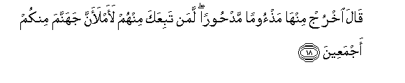

# قَالَ اخْرُجْ مِنْهَا مَذْءُومًا مَدْحُورًا ۖ لَمَنْ تَبِعَكَ مِنْهُمْ لَأَمْلَأَنَّ جَهَنَّمَ مِنْكُمْ أَجْمَعِينَ 

##Qala okhruj minha mathooman madhooran laman tabiAAaka minhum laamlaanna jahannama minkum ajmaAAeena 

## 翻译(Translation)：

| Translator | 译文(Translation)                                            |
| :--------: | ------------------------------------------------------------ |
|    马坚    | 主说：你被贬责地，被弃绝地从这里出去吧！他们中凡是顺从你的，我必以你和他们一起充满火狱。 |
|  YUSUFALI  | (Allah) said: "Get out from this, disgraced and expelled. If any of them follow thee,- Hell will I fill with you all. |
| PICKTHALL  | He said: Go forth from hence, degraded, banished. As for such of them as follow thee, surely I will fill hell with all of you. |
|   SHAKIR   | He said: Get out of this (state), despised, driven away; whoever of them will follow you, I will certainly fill hell with you all. |

---

## 对位释义(Words Interpretation)：

| No   | العربية | 中文    | English | 曾用词 |
| ---- | ------: | ------- | ------- | ------ |
| 序号 |    阿文 | Chinese | 英文    | Used   |
| 7:18.1  | قَالَ    | 他说，     | He said             | 见2:30.2   |
| 7:18.2  | اخْرُجْ   | 你出去     | Get out             |            |
| 7:18.3  | مِنْهَا   | 从它       | From it             | 见2:25.15  |
| 7:18.4  | مَذْءُومًا | 被贬责地   | degraded            |            |
| 7:18.5  | مَدْحُورًا | 被弃绝地   | banished            |            |
| 7:18.6  | لَمَنْ    | 的确谁     | there are those who | 见3:199.5  |
| 7:18.7  | تَبِعَكَ   | 他顺从你   | he will follow you  |            |
| 7:18.8  | مِنْهُمْ   | 从他们     | from them           | 见2:75.8   |
| 7:18.9  | لَأَمْلَأَنَّ | 必定我填充 | surely I will fill  |            |
| 7:18.10 | جَهَنَّمَ   | 火狱       | Hell                | 见3:12.7   |
| 7:18.11 | مِنْكُمْ   | 从你们     | Of you              | 见2:65.5   |
| 7:18.12 | أَجْمَعِينَ | 全体       | all                 | 见2:161.13 |

---