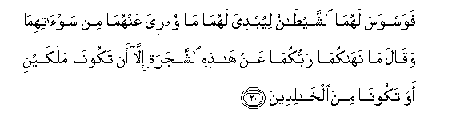

# فَوَسْوَسَ لَهُمَا الشَّيْطَانُ لِيُبْدِيَ لَهُمَا مَا وُورِيَ عَنْهُمَا مِنْ سَوْآتِهِمَا وَقَالَ مَا نَهَاكُمَا رَبُّكُمَا عَنْ هَٰذِهِ الشَّجَرَةِ إِلَّا أَنْ تَكُونَا مَلَكَيْنِ أَوْ تَكُونَا مِنَ الْخَالِدِينَ 

##Fawaswasa lahuma alshshaytanu liyubdiya lahuma ma wooriya AAanhuma min saw-atihima waqala manahakuma rabbukuma AAan hathihi alshshajarati illa an takoona malakayni aw takoona mina alkhalideena 

## 翻译(Translation)：

| Translator | 译文(Translation)                                            |
| :--------: | ------------------------------------------------------------ |
|    马坚    | 但恶魔教唆他俩，以致为他俩显出他俩的被遮盖的阴部。他说：你俩的主禁你们俩吃这棵树的果实，只为不愿你俩变成天神，或永生不灭。 |
|  YUSUFALI  | Then began Satan to whisper suggestions to them, bringing openly before their minds all their shame that was hidden from them (before): he said: "Your Lord only forbade you this tree, lest ye should become angels or such beings as live for ever." |
| PICKTHALL  | Then Satan whispered to them that he might manifest unto them that which was hidden from them of their shame, and he said: Your Lord forbade you from this tree only lest ye should become angels or become of the immortals. |
|   SHAKIR   | But the Shaitan made an evil suggestion to them that he might make manifest to them what had been hidden from them of their evil inclinations, and he said: Your Lord has not forbidden you this tree except that you may not both become two angels or that you may (not) become of the immortals. |

---

## 对位释义(Words Interpretation)：

| No   | العربية | 中文    | English | 曾用词 |
| ---- | ------: | ------- | ------- | ------ |
| 序号 |    阿文 | Chinese | 英文    | Used   |
| 7:20.1  | فَوَسْوَسَ    | 因此他教唆 | But he made an evil suggestion |            |
| 7:20.2  | لَهُمَا     | 为他俩     | to them                        |            |
| 7:20.3  | الشَّيْطَانُ  | 恶魔       | Satan                          | 见2:36.2   |
| 7:20.4  | لِيُبْدِيَ    | 以便他显出 | that he might manifest         |            |
| 7:20.5  | لَهُمَا     | 为他俩     | to them                        | 见7:20.2   |
| 7:20.6  | مَا       | 什么       | what/ that which               | 见2:17.8   |
| 7:20.7  | وُورِيَ     | 它被隐藏   | it was hidden                  |            |
| 7:20.8  | عَنْهُمَا    | 从他俩     | on them                        | 见4:16.9   |
| 7:20.9  | مِنْ       | 从         | from                           | 见2:4.8    |
| 7:20.10 | سَوْآتِهِمَا  | 他俩的私部 | their shame                    |            |
| 7:20.11 | وَقَالَ     | 和他说，   | and he said                    | 见2:118.1  |
| 7:20.12 | مَا       | 不         | not                            | 见2:120.24 |
| 7:20.13 | نَهَاكُمَا   | 他禁止你俩 | he forbade you                 |            |
| 7:20.14 | رَبُّكُمَا    | 你俩的养主 | Your Lord                      |            |
| 7:20.15 | عَنْ       | 从         | on                             | 见2:48.6   |
| 7:20.16 | هَٰذِهِ      | 这个       | this                           | 见2:35.15  |
| 7:20.17 | الشَّجَرَةِ   | 树         | tree                           |            |
| 7:20.18 | إِلَّا      | 除了       | Except                         | 见2:9.7    |
| 7:20.19 | أَنْ       | 该         | that                           | 见2:26.5   |
| 7:20.20 | تَكُونَا    | 你俩成为   | you should become              |            |
| 7:20.21 | مَلَكَيْنِ    | 两个天使   | two angels                     |            |
| 7:20.22 | أَوْ       | 或         | or                             | 见2:19.1   |
| 7:20.23 | تَكُونَا    | 你俩成为   | you should become              | 见7:20.20  |
| 7:20.24 | مِنَ       | 从         | from                           | 见2:4.8    |
| 7:20.25 | الْخَالِدِينَ | 永生不灭   | the immortals                  |            |

---