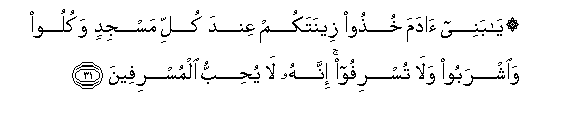

# ۞ يَا بَنِي آدَمَ خُذُوا زِينَتَكُمْ عِنْدَ كُلِّ مَسْجِدٍ وَكُلُوا وَاشْرَبُوا وَلَا تُسْرِفُوا ۚ إِنَّهُ لَا يُحِبُّ الْمُسْرِفِينَ 

##Ya banee adama khuthoo zeenatakum AAinda kulli masjidin wakuloo waishraboo wala tusrifoo innahu la yuhibbu almusrifeena 

## 翻译(Translation)：

| Translator | 译文(Translation)                                            |
| :--------: | ------------------------------------------------------------ |
|    马坚    | 阿丹的子孙啊！每逢礼拜，你们必须穿著服饰。你们应当吃，应当喝，但不要过分，真主确是不喜欢过分者的。 |
|  YUSUFALI  | O Children of Adam! wear your beautiful apparel at every time and place of prayer: eat and drink: But waste not by excess, for Allah loveth not the wasters. |
| PICKTHALL  | O Children of Adam! Look to your adornment at every place of worship, and eat and drink, but be not prodigal. Lo! He loveth not the prodigals. |
|   SHAKIR   | O children of Adam! attend to your embellishments at every time of prayer, and eat and drink and be not extravagant; surely He does not love the extravagant. |

---

## 对位释义(Words Interpretation)：

| No   | العربية | 中文    | English | 曾用词 |
| ---- | ------: | ------- | ------- | ------ |
| 序号 |    阿文 | Chinese | 英文    | Used   |
| 7:31.1  | يَا       | 啊             | Oh               | 见2:21.1   |
| 7:31.2  | بَنِي      | 后裔           | Children         | 见2:40.2   |
| 7:31.3  | آدَمَ      | 阿丹           | Adam             | 见2:31.2   |
| 7:31.4  | خُذُوا     | 你们守         | Take hold of     | 见2:63.7   |
| 7:31.5  | زِينَتَكُمْ   | 你们的装饰     | your adornment   |            |
| 7:31.6  | عِنْدَ      | 以             | with             | 见2:54.20  |
| 7:31.7  | كُلِّ       | 所有           | All              | 见2:20.23  |
| 7:31.8  | مَسْجِدٍ     | 清真寺         | place of worship | 见7:29.9   |
| 7:31.9  | وَكُلُوا    | 和吃           | and eat          | 见2:187.31 |
| 7:31.10 | وَاشْرَبُوا  | 和饮           | And drink        | 见2:60.20  |
| 7:31.11 | وَلَا      | 也不           | and not          | 见1:7.8    |
| 7:31.12 | تُسْرِفُوا   | 浪费           | extravagant      | 见6:141.27 |
| 7:31.13 | إِنَّهُ      | 确实他         | he is            | 见2:37.8   |
| 7:31.14 | لَا       | 不，不是，没有 | no               | 见2:2.3    |
| 7:31.15 | يُحِبُّ      | 喜欢           | love             | 见2:190.12 |
| 7:31.16 | الْمُسْرِفِينَ | 众浪费者       | the extravagant  | 见6:141.31 |

---