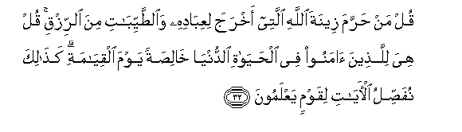

# قُلْ مَنْ حَرَّمَ زِينَةَ اللَّهِ الَّتِي أَخْرَجَ لِعِبَادِهِ وَالطَّيِّبَاتِ مِنَ الرِّزْقِ ۚ قُلْ هِيَ لِلَّذِينَ آمَنُوا فِي الْحَيَاةِ الدُّنْيَا خَالِصَةً يَوْمَ الْقِيَامَةِ ۗ كَذَٰلِكَ نُفَصِّلُ الْآيَاتِ لِقَوْمٍ يَعْلَمُونَ 

##Qul man harrama zeenata Allahi allatee akhraja liAAibadihi waalttayyibati mina alrrizqi qul hiya lillatheena amanoo fee alhayati alddunya khalisatan yawma alqiyamati kathalika nufassilu al-ayati liqawmin yaAAlamoona 

## 翻译(Translation)：

| Translator | 译文(Translation)                                            |
| :--------: | ------------------------------------------------------------ |
|    马坚    | 你说：真主为他的臣民而创造的服饰和佳美的食物，谁能禁止他们去享受呢？你说：那些物品为信道者在今世所共有，在复活日所独享的。我为有知识的民众这样解释一切迹象。 |
|  YUSUFALI  | Say: Who hath forbidden the beautiful (gifts) of Allah, which He hath produced for His servants, and the things, clean and pure, (which He hath provided) for sustenance? Say: They are, in the life of this world, for those who believe, (and) purely for them on the Day of Judgment. Thus do We explain the signs in detail for those who understand. |
| PICKTHALL  | Say: Who hath forbidden the adornment of Allah which He hath brought forth for His bondmen, and the good things of His providing? Say: Such, on the Day of Resurrection, will be only for those who believed during the life of the world. Thus do we detail Our revelations for people who have knowledge. |
|   SHAKIR   | Say: Who has prohibited the embellishment of Allah which He has brought forth for His servants and the good provisions? Say: These are for the believers in the life of this world, purely (theirs) on the resurrection day; thus do We make the communications clear for a people who know. |

---

## 对位释义(Words Interpretation)：

| No   | العربية | 中文    | English | 曾用词 |
| ---- | ------: | ------- | ------- | ------ |
| 序号 |    阿文 | Chinese | 英文    | Used   |
| 7:32.1  | قُلْ       | 你说             | Say                 | 见2:80.8   |
| 7:32.2  | مَنْ       | 谁               | who                 | 见2:8.3    |
| 7:32.3  | حَرَّمَ      | 禁止             | forbidden           | 见2:173.2  |
| 7:32.4  | زِينَةَ     | 装饰             | the adornment       | 参7:31.5   |
| 7:32.5  | اللَّهِ     | 真主的           | of Allah            | 见2:23.17  |
| 7:32.6  | الَّتِي     | 哪               | Which               | 见2:24.8   |
| 7:32.7  | أَخْرَجَ     | 他逐出           | he expelled         | 见7:27.8   |
| 7:32.8  | لِعِبَادِهِ   | 为他的仆人       | for His servants    | 参2:90.20  |
| 7:32.9  | وَالطَّيِّبَاتِ | 和佳美物品       | and the good things |            |
| 7:32.10 | مِنَ       | 从               | from                | 见2:19.3 |
| 7:32.11 | الرِّزْقِ    | 给养             | provisions          |            |
| 7:32.12 | قُلْ       | 你说             | Say                 | 见2:80.8   |
| 7:32.13 | هِيَ       | 她               | she                 | 见2:68.8   |
| 7:32.14 | لِلَّذِينَ    | 对那些人         | to those who        | 见2:79.2   |
| 7:32.15 | آمَنُوا    | 诚信             | believe             | 见2:9.4    |
| 7:32.16 | فِي       | 在               | in                  | 见2:10.1   |
| 7:32.17 | الْحَيَاةِ   | 生活             | Life                | 见2:85.37  |
| 7:32.18 | الدُّنْيَا   | 今世             | this world          | 见2:85.38  |
| 7:32.19 | خَالِصَةً    | 独享的           | purely              | 见2:94.9   |
| 7:32.20 | يَوْمَ      | 日，日子，时候的 | day                 | 见1:4.2    |
| 7:32.21 | الْقِيَامَةِ  | 复活的           | Resurrection        | 见2:85.40  |
| 7:32.22 | كَذَٰلِكَ     | 像如此           | Thus                | 见2:73.4   |
| 7:32.23 | نُفَصِّلُ     | 我们解释         | We explain          | 见6:55.2   |
| 7:32.24 | الْآيَاتِ   | 众迹象           | the signs           | 见2:118.22 |
| 7:32.25 | لِقَوْمٍ     | 对人们           | For the people      | 见2:118.23 |
| 7:32.26 | يَعْلَمُونَ   | 知道             | Know                | 见2:13.19  |

---