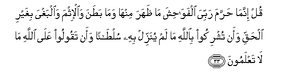

# قُلْ إِنَّمَا حَرَّمَ رَبِّيَ الْفَوَاحِشَ مَا ظَهَرَ مِنْهَا وَمَا بَطَنَ وَالْإِثْمَ وَالْبَغْيَ بِغَيْرِ الْحَقِّ وَأَنْ تُشْرِكُوا بِاللَّهِ مَا لَمْ يُنَزِّلْ بِهِ سُلْطَانًا وَأَنْ تَقُولُوا عَلَى اللَّهِ مَا لَا تَعْلَمُونَ 

##Qul innama harrama rabbiya alfawahisha ma thahara minha wama batana waal-ithma waalbaghya bighayri alhaqqi waan tushrikoo biAllahi ma lam yunazzil bihi sultanan waan taqooloo AAala Allahi ma la taAAlamoona 

## 翻译(Translation)：

| Translator | 译文(Translation)                                            |
| :--------: | ------------------------------------------------------------ |
|    马坚    | 你说：我的主只禁止一切明显的和隐微的丑事，和罪恶，和无理的侵害，以及用真主所未证实的事物配真主，假借真主的名义而妄言自己所不知道的事情。 |
|  YUSUFALI  | Say: the things that my Lord hath indeed forbidden are: shameful deeds, whether open or secret; sins and trespasses against truth or reason; assigning of partners to Allah, for which He hath given no authority; and saying things about Allah of which ye have no knowledge. |
| PICKTHALL  | Say: My Lord forbiddeth only indecencies, such of them as are apparent and such as are within, and sin and wrongful oppression, and that ye associate with Allah that for which no warrant hath been revealed, and that ye tell concerning Allah that which ye know not. |
|   SHAKIR   | Say: My Lord has only prohibited indecencies, those of them that are apparent as well as those that are concealed, and sin and rebellion without justice, and that you associate with Allah that for which He has not sent down any authority, and that you say against Allah what you do not know. |

---

## 对位释义(Words Interpretation)：

| No   | العربية | 中文    | English | 曾用词 |
| ---- | ------: | ------- | ------- | ------ |
| 序号 |    阿文 | Chinese | 英文    | Used   |
| 7:33.1  | قُلْ      | 你说           | Say              | 见2:80.8   |
| 7:33.2  | إِنَّمَا    | 仅仅           | only             | 见2:11.9   |
| 7:33.3  | حَرَّمَ     | 禁止           | forbidden        | 见2:173.2  |
| 7:33.4  | رَبِّيَ     | 我的养主       | My Lord          | 见2:258.16 |
| 7:33.5  | الْفَوَاحِشَ | 众丑事         | indecencies      | 见6:151.24 |
| 7:33.6  | مَا      | 什么           | what/ that which | 见2:17.8   |
| 7:33.7  | ظَهَرَ     | 明显           | open             | 见6:151.26 |
| 7:33.8  | مِنْهَا    | 从它           | From it          | 见2:25.15  |
| 7:33.9  | وَمَا     | 和什么         | and that         | 见2:4.6    |
| 7:33.10 | بَطَنَ     | 隐微           | concealed        | 见6:151.29 |
| 7:33.11 | وَالْإِثْمَ  | 和罪恶         | and sinful       | 参5:63.7   |
| 7:33.12 | وَالْبَغْيَ  | 和侵害         | and trespasses   |            |
| 7:33.13 | بِغَيْرِ    | 在没有         | without          | 见2:61.54  |
| 7:33.14 | الْحَقِّ    | 正确的，真理   | Right, truth     | 见2:26.17  |
| 7:33.15 | وَأَنْ     | 和那个         | and that         | 见2:169.5  |
| 7:33.16 | تُشْرِكُوا  | 你们采配       | associate        | 见4:36.4   |
| 7:33.17 | بِاللَّهِ   | 在真主         | in Allah         | 见2:8.6    |
| 7:33.18 | مَا      | 什么           | what/ that which | 见2:17.8   |
| 7:33.19 | لَمْ      | 不，没有       | did not          | 见2:6.8    |
| 7:33.20 | يُنَزِّلْ    | 他降示         | He has sent down | 见3:151.12 |
| 7:33.21 | بِهِ      | 以它           | with it          | 见2:22.13  |
| 7:33.22 | سُلْطَانًا  | 证据           | authority        | 见3:151.14 |
| 7:33.23 | وَأَنْ     | 和那个         | and that         | 见2:169.5  |
| 7:33.24 | تَقُولُوا  | 你们说         | You say          | 见2:104.6  |
| 7:33.25 | عَلَى     | 至             | On               | 见2:5.2    |
| 7:33.26 | اللَّهِ    | 真主的         | of Allah         | 见2:23.17  |
| 7:33.27 | مَا      | 什么           | what/ that which | 见2:17.8   |
| 7:33.28 | لَا      | 不，不是，没有 | no               | 见2:2.3    |
| 7:33.29 | تَعْلَمُونَ  | 你知道         | You know         | 见2:22.23  |

---