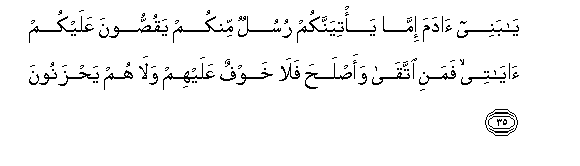

# يَا بَنِي آدَمَ إِمَّا يَأْتِيَنَّكُمْ رُسُلٌ مِنْكُمْ يَقُصُّونَ عَلَيْكُمْ آيَاتِي ۙ فَمَنِ اتَّقَىٰ وَأَصْلَحَ فَلَا خَوْفٌ عَلَيْهِمْ وَلَا هُمْ يَحْزَنُونَ  

##Ya banee adama imma ya/tiyannakum rusulun minkum yaqussoona AAalaykum ayatee famani ittaqa waaslaha fala khawfun AAalayhim wala hum yahzanoona 

## 翻译(Translation)：

| Translator | 译文(Translation)                                            |
| :--------: | ------------------------------------------------------------ |
|    马坚    | 阿丹的子孙啊！如果你们同族中的使者来对你们讲述我的迹象，那末，凡敬畏而且修身者，将来都没有恐惧，也不忧愁。 |
|  YUSUFALI  | O ye Children of Adam! whenever there come to you messengers from amongst you, rehearsing My signs unto you,- those who are righteous and mend (their lives),- on them shall be no fear nor shall they grieve. |
| PICKTHALL  | O Children of Adam! When messengers of your own come unto you who narrate unto you My revelations, then whosoever refraineth from evil and amendeth - there shall no fear come upon them neither shall they grieve. |
|   SHAKIR   | O children of Adam! if there come to you messengers from among you relating to you My communications, then whoever shall guard (against evil) and act aright-- they shall have no fear nor shall they grieve. |

---

## 对位释义(Words Interpretation)：

| No   | العربية | 中文    | English | 曾用词 |
| ---- | ------: | ------- | ------- | ------ |
| 序号 |    阿文 | Chinese | 英文    | Used   |
| 7:35.1  | يَا      | 啊         | Oh             | 见2:21.1   |
| 7:35.2  | بَنِي     | 后裔       | Children       | 见2:40.2   |
| 7:35.3  | آدَمَ     | 阿丹       | Adam           | 见2:31.2   |
| 7:35.4  | إِمَّا     | 如果       | if             | 参6:68.14 |
| 7:35.5  | يَأْتِيَنَّكُمْ | 来到你们   | come to you    | 见2:38.6   |
| 7:35.6  | رُسُلٌ     | 众使者     | Messengers     | 见3:183.18 |
| 7:35.7  | مِنْكُمْ    | 从你们     | Of you         | 见2:65.5   |
| 7:35.8  | يَقُصُّونَ   | 他们诵读   | they recounted | 见6:130.9  |
| 7:35.9  | عَلَيْكُمْ   | 在你们     | on you         | 见2:40.8   |
| 7:35.10 | آيَاتِي   | 我的众迹象 | My Signs       | 见6:130.11 |
| 7:35.11 | فَمَنِ     | 然后谁     | then who       | 见2:173.13 |
| 7:35.12 | اتَّقَىٰ    | 敬畏       | fear           | 见2:189.19 |
| 7:35.13 | وَأَصْلَحَ   | 和行善     | and do right   | 见5:39.6   |
| 7:35.14 | فَلَا     | 因此不     | shall not      | 见2:22.18  |
| 7:35.15 | خَوْفٌ     | 恐惧       | fear           | 见2:38.13  |
| 7:35.16 | عَلَيْهِمْ   | 在他们     | on they        | 见1:7.4    |
| 7:35.17 | وَلَا     | 也不       | and not        | 见1:7.8    |
| 7:35.18 | هُمْ      | 他们       | they           | 见2:4.11   |
| 7:35.19 | يَحْزَنُونَ  | 忧愁       | Grieve         | 见2:38.17  |

---