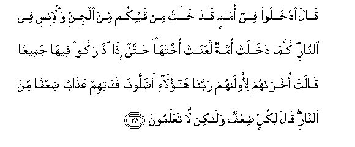

# قَالَ ادْخُلُوا فِي أُمَمٍ قَدْ خَلَتْ مِنْ قَبْلِكُمْ مِنَ الْجِنِّ وَالْإِنْسِ فِي النَّارِ ۖ كُلَّمَا دَخَلَتْ أُمَّةٌ لَعَنَتْ أُخْتَهَا ۖ حَتَّىٰ إِذَا ادَّارَكُوا فِيهَا جَمِيعًا قَالَتْ أُخْرَاهُمْ لِأُولَاهُمْ رَبَّنَا هَٰؤُلَاءِ أَضَلُّونَا فَآتِهِمْ عَذَابًا ضِعْفًا مِنَ النَّارِ ۖ قَالَ لِكُلٍّ ضِعْفٌ وَلَٰكِنْ لَا تَعْلَمُونَ 

##Qala odkhuloo fee omamin qad khalat min qablikum mina aljinni waal-insi fee alnnari kullama dakhalat ommatun laAAanat okhtaha hatta itha iddarakoo feeha jameeAAan qalat okhrahum li-oolahum rabbana haola-i adalloonafaatihim AAathaban diAAfan mina alnnari qala likullin diAAfun walakin la taAAlamoona 

## 翻译(Translation)：

| Translator | 译文(Translation)                                            |
| :--------: | ------------------------------------------------------------ |
|    马坚    | 真主将要说：你们同精灵和人类中以前逝去的各民族一起进入火狱吧。每当一个民族进火狱去，总要咒骂她的姐妹民族，直到他们统统到齐了。他们中后进的论及先进的说：我们的主啊！这等人曾使我们迷误，求你使他们受加倍的火刑。主说：每个人都受加倍的火刑，但你们不知道。 |
|  YUSUFALI  | He will say: "Enter ye in the company of the peoples who passed away before you - men and jinns, - into the Fire." Every time a new people enters, it curses its sister-people (that went before), until they follow each other, all into the Fire. Saith the last about the first: "Our Lord! it is these that misled us: so give them a double penalty in the Fire." He will say: "Doubled for all" : but this ye do not understand. |
| PICKTHALL  | He saith: Enter into the Fire among nations of the jinn and humankind who passed away before you. Every time a nation entereth, it curseth its sister (nation) till, when they have all been made to follow one another thither, the last of them saith unto the first of them: Our Lord! These led us astray, so give them double torment of the Fire. He saith: For each one there is double (torment), but ye know not. |
|   SHAKIR   | He will say: Enter into fire among the nations that have passed away before you from among jinn and men; whenever a nation shall enter, it shall curse its sister, until when they have all come up with one another into it; the last of them shall say with regard to the foremost of them: Our Lord! these led us astray therefore give them a double chastisement of the fire. He will say: Every one shall have double but you do not know. |

---

## 对位释义(Words Interpretation)：

| No   | العربية | 中文    | English | 曾用词 |
| ---- | ------: | ------- | ------- | ------ |
| 序号 |    阿文 | Chinese | 英文    | Used   |
| 7:38.1  | قَالَ     | 他说，         | He said                | 见2:30.2  |
| 7:38.2  | ادْخُلُوا  | 进入           | Enter                  | 见2:58.3  |
| 7:38.3  | فِي      | 在             | in                     | 见2:10.1  |
| 7:38.4  | أُمَمٍ     | 各民族         | nations                | 见6:42.4  |
| 7:38.5  | قَدْ      | 当然           | may                    | 见2:60.14 |
| 7:38.6  | خَلَتْ     | 逝去           | passed away            | 见2:134.4 |
| 7:38.7  | مِنْ      | 从             | from                   | 见2:4.8   |
| 7:38.8  | قَبْلِكُمْ   | 在你以前       | Before you             | 见2:21.10 |
| 7:38.9  | مِنَ      | 从             | from                   | 见2:19.3  |
| 7:38.10 | الْجِنِّ    | 精灵的         | of the jinn            | 见6:128.6 |
| 7:38.11 | وَالْإِنْسِ  | 和世人的       | and of humankind       | 见6:130.4 |
| 7:38.12 | فِي      | 在             | in                     | 见2:10.1  |
| 7:38.13 | النَّارِ   | 火狱           | the Fire               | 见2:24.7  |
| 7:38.14 | كُلَّمَا    | 每当           | whenever               | 见2:20.5  |
| 7:38.15 | دَخَلَتْ    | 他进入         | he enters              |           |
| 7:38.16 | أُمَّةٌ     | 一个民族       | a nation               | 见2:128.7 |
| 7:38.17 | لَعَنَتْ    | 她诅咒         | it curses              |           |
| 7:38.18 | أُخْتَهَا   | 她的姐妹       | its sister             |           |
| 7:38.19 | حَتَّىٰ     | 直到           | Until                  | 见2:55.8  |
| 7:38.20 | إِذَا     | 当时           | when                   | 见2:156.2 |
| 7:38.21 | ادَّارَكُوا | 他们集合       | they follow each other |           |
| 7:38.22 | فِيهَا    | 在其中         | therein                | 见2:25.29 |
| 7:38.23 | جَمِيعًا   | 所有           | All                    | 见2:29.8  |
| 7:38.24 | قَالَتْ    | 她说           | she said               | 见3:36.3  |
| 7:38.25 | أُخْرَاهُمْ  | 他们的最后者   | the last of them       |           |
| 7:38.26 | لِأُولَاهُمْ | 对他们的最先者 | to the first of them   |           |
| 7:38.27 | رَبَّنَا    | 我们的主       | Our Lord               | 见2:127.8 |
| 7:38.28 | هَٰؤُلَاءِ   | 这些           | Those                  | 见2:31.12 |
| 7:38.29 | أَضَلُّونَا  | 他们误导我们   | these led us astray    |           |
| 7:38.30 | فَآتِهِمْ   | 因此求你给他们 | so give them           |           |
| 7:38.31 | عَذَابًا   | 刑罚           | chastisement           | 见3:56.5  |
| 7:38.32 | ضِعْفًا    | 双倍的         | a double               |           |
| 7:38.33 | مِنَ      | 从             | from                   | 见2:19.3  |
| 7:38.34 | النَّارِ   | 火狱           | the Fire               | 见2:24.7  |
| 7:38.35 | قَالَ     | 他说，         | He said                | 见2:30.2  |
| 7:38.36 | لِكُلٍّ     | 为每个         | for each               | 见5:48.25 |
| 7:38.37 | ضِعْفٌ     | 双倍           | double                 | 参7:38.32 |
| 7:38.38 | وَلَٰكِنْ    | 并且但是       | and but                | 见2:12.5  |
| 7:38.39 | لَا      | 不，不是，没有 | no                     | 见2:2.3   |
| 7:38.40 | تَعْلَمُونَ  | 你知道         | You know               | 见2:22.23 |

---