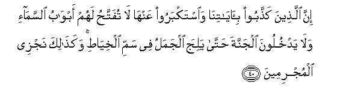

# إِنَّ الَّذِينَ كَذَّبُوا بِآيَاتِنَا وَاسْتَكْبَرُوا عَنْهَا لَا تُفَتَّحُ لَهُمْ أَبْوَابُ السَّمَاءِ وَلَا يَدْخُلُونَ الْجَنَّةَ حَتَّىٰ يَلِجَ الْجَمَلُ فِي سَمِّ الْخِيَاطِ ۚ وَكَذَٰلِكَ نَجْزِي الْمُجْرِمِينَ 

##Inna allatheena kaththaboo bi-ayatina waistakbaroo AAanha la tufattahu lahum abwabu alssama-i walayadkhuloona aljannata hatta yalija aljamalu fee sammi alkhiyati wakathalika najzee almujrimeena 

## 翻译(Translation)：

| Translator | 译文(Translation)                                            |
| :--------: | ------------------------------------------------------------ |
|    马坚    | 否认我的迹象而加以藐视者，所有的天门必不为他们而开放，他们不得入乐园，直到缆绳能穿过针眼。我要这样报酬犯罪者。 |
|  YUSUFALI  | To those who reject Our signs and treat them with arrogance, no opening will there be of the gates of heaven, nor will they enter the garden, until the camel can pass through the eye of the needle: Such is Our reward for those in sin. |
| PICKTHALL  | Lo! they who deny Our revelations and scorn them, for them the gates of heaven will nor be opened not will they enter the Garden until the camel goeth through the needle's eye. Thus do We requite the guilty. |
|   SHAKIR   | Surely (as for) those who reject Our communications and turn away from them haughtily, the doors of heaven shall not be opened for them, nor shall they enter the garden until the camel pass through the eye of the needle; and thus do We reward the guilty. |

---

## 对位释义(Words Interpretation)：

| No   | العربية | 中文    | English | 曾用词 |
| ---- | ------: | ------- | ------- | ------ |
| 序号 |    阿文 | Chinese | 英文    | Used   |
| 7:40.1  | إِنَّ        | 的确           | surely                | 见2:6.1    |
| 7:40.2  | الَّذِينَ     | 谁，那些       | those who             | 见2:6.2    |
| 7:40.3  | كَذَّبُوا     | 他们否认       | they denied           | 见3:11.7   |
| 7:40.4  | بِآيَاتِنَا   | 在我们的迹象   | in Our signs          | 见2:39.4   |
| 7:40.5  | وَاسْتَكْبَرُوا | 和他们妄自尊大 | and thye are arrogant | 见4:173.14 |
| 7:40.6  | عَنْهَا      | 从它           | from it               | 见2:36.3   |
| 7:40.7  | لَا        | 不，不是，没有 | no                    | 见2:2.3    |
| 7:40.8  | تُفَتَّحُ      | 它被开放       | will be opened        |            |
| 7:40.9  | لَهُمْ       | 对他们         | for them              | 见2:11.3   |
| 7:40.10 | أَبْوَابُ     | 众门           | the doors             |            |
| 7:40.11 | السَّمَاءِ    | 天空           | The sky, heaven       | 见2:19.4   |
| 7:40.12 | وَلَا       | 也不           | and not               | 见1:7.8    |
| 7:40.13 | يَدْخُلُونَ    | 他们进入       | they will enter       | 见4:124.12 |
| 7:40.14 | الْجَنَّةَ     | 天园           | Paradise              | 见2:35.7   |
| 7:40.15 | حَتَّىٰ       | 直到           | Until                 | 见2:55.8   |
| 7:40.16 | يَلِجَ       | 它通过         | it pass through       |            |
| 7:40.17 | الْجَمَلُ     | 一只骆驼       | the camel             |            |
| 7:40.18 | فِي        | 在             | in                    | 见2:10.1   |
| 7:40.19 | سَمِّ        | 眼睛           | the eye               |            |
| 7:40.20 | الْخِيَاطِ    | 一个针的       | of the needle         |            |
| 7:40.21 | وَكَذَٰلِكَ     | 和像如此       | and Thus              | 见2:143.1  |
| 7:40.22 | نَجْزِي      | 我们报酬       | We reward             | 见6:84.20  |
| 7:40.23 | الْمُجْرِمِينَ  | 众罪人的       | of the sinners        | 见6:55.6   |

---