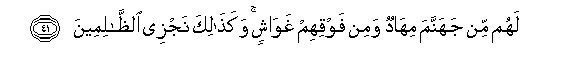

# لَهُمْ مِنْ جَهَنَّمَ مِهَادٌ وَمِنْ فَوْقِهِمْ غَوَاشٍ ۚ وَكَذَٰلِكَ نَجْزِي الظَّالِمِينَ 

##Lahum min jahannama mihadun wamin fawqihim ghawashin wakathalika najzee alththalimeena 

## 翻译(Translation)：

| Translator | 译文(Translation)                                            |
| :--------: | ------------------------------------------------------------ |
|    马坚    | 他们在火狱里要垫火褥，要盖火被，我要这样报酬不义者。         |
|  YUSUFALI  | For them there is Hell, as a couch (below) and folds and folds of covering above: such is Our requital of those who do wrong. |
| PICKTHALL  | Theirs will be a bed of hell, and over them coverings (of hell). Thus do We requite wrong-doers. |
|   SHAKIR   | They shall have a bed of hell-fire and from above them coverings (of it); and thus do We reward the unjust. |

---

## 对位释义(Words Interpretation)：

| No   | العربية | 中文    | English | 曾用词 |
| ---- | ------: | ------- | ------- | ------ |
| 序号 |    阿文 | Chinese | 英文    | Used   |
| 7:41.1  | لَهُمْ      | 对他们     | for them   | 见2:11.3  |
| 7:41.2  | مِنْ       | 从         | from       | 见2:4.8   |
| 7:41.3  | جَهَنَّمَ     | 火狱       | Hell       | 见3:12.7  |
| 7:41.4  | مِهَادٌ     | 床         | a bed      |           |
| 7:41.5  | وَمِنْ      | 和从       | And from   | 见2:8.1   |
| 7:41.6  | فَوْقِهِمْ    | 他们的上面 | above them | 见5:66.13 |
| 7:41.7  | غَوَاشٍ     | 覆盖       | coverings  |           |
| 7:41.8  | وَكَذَٰلِكَ    | 和像如此   | and Thus   | 见2:143.1 |
| 7:41.9  | نَجْزِي     | 我们报酬   | We reward  | 见6:84.20 |
| 7:41.10 | الظَّالِمِينَ | 不义的人   | unjust     | 见2:35.19 |

---