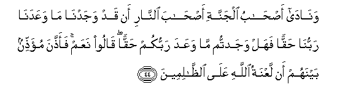

# وَنَادَىٰ أَصْحَابُ الْجَنَّةِ أَصْحَابَ النَّارِ أَنْ قَدْ وَجَدْنَا مَا وَعَدَنَا رَبُّنَا حَقًّا فَهَلْ وَجَدْتُمْ مَا وَعَدَ رَبُّكُمْ حَقًّا ۖ قَالُوا نَعَمْ ۚ فَأَذَّنَ مُؤَذِّنٌ بَيْنَهُمْ أَنْ لَعْنَةُ اللَّهِ عَلَى الظَّالِمِينَ 

##Wanada as-habu aljannati as-haba alnnari an qad wajadna ma waAAadana rabbuna haqqan fahal wajadtum mawaAAada rabbukum haqqan qaloo naAAam faaththana mu-aththinun baynahum an laAAnatu Allahi AAalaalththalimeena 

## 翻译(Translation)：

| Translator | 译文(Translation)                                            |
| :--------: | ------------------------------------------------------------ |
|    马坚    | 乐园的居民将大声地对火狱的居民说：我们已发现我们的主所应许我们的是真实的了。你们是否也发现你们的主所应许你们的是真实的吗？他们说：是的。于是，一个喊叫者要在他们中间喊叫说：真主的弃绝归于不义者。 |
|  YUSUFALI  | The Companions of the Garden will call out to the Companions of the Fire: "We have indeed found the promises of our Lord to us true: Have you also found Your Lord's promises true?" They shall say, "Yes"; but a crier shall proclaim between them: "The curse of Allah is on the wrong-doers;- |
| PICKTHALL  | And the dwellers of the Garden cry unto the dwellers of the Fire: We have found that which our Lord promised us (to be) the Truth. Have ye (too) found that which your Lord promised the Truth? They say: Yea, verily. And a crier in between them crieth: The curse of Allah is on evil-doers, |
|   SHAKIR   | And the dwellers of the garden will call out to the inmates of the fire: Surely we have found what our Lord promised us to be true; have you too found what your Lord promised to be true? They will say: Yes. Then a crier will cry out among them that the curse of Allah is on the unjust. |

---

## 对位释义(Words Interpretation)：

| No   | العربية | 中文    | English | 曾用词 |
| ---- | ------: | ------- | ------- | ------ |
| 序号 |    阿文 | Chinese | 英文    | Used   |
| 7:44.1  | وَنَادَىٰ    | 和他大声说 | and he will call out |            |
| 7:44.2  | أَصْحَابُ    | 居民       | companions    | 见2:39.6   |
| 7:44.3  | الْجَنَّةِ    | 乐园       | the Garden           | 见2:35.7   |
| 7:44.4  | أَصْحَابَ    | 居民       | companions           | 见4:27.24  |
| 7:44.5  | النَّارِ    | 火狱       | the Fire             | 见2:24.7   |
| 7:44.6  | أَنْ       | 该         | that                 | 见2:26.5   |
| 7:44.7  | قَدْ       | 当然       | may                  | 见2:60.14  |
| 7:44.8  | وَجَدْنَا    | 我们发现   | we found             | 见5:104.14 |
| 7:44.9  | مَا       | 什么       | what/ that which     | 见2:17.8   |
| 7:44.10 | وَعَدَنَا    | 他允诺我们 | he promised us       |            |
| 7:44.11 | رَبُّنَا     | 我们的主   | Our Lord             | 见2:139.6 |
| 7:44.12 | حَقًّا      | 真实       | the truth            | 见4:122.16 |
| 7:44.13 | فَهَلْ      | 因此       | then                 | 见5:91.18  |
| 7:44.14 | وَجَدْتُمْ    | 你们发现   | you found            |            |
| 7:44.15 | مَا       | 什么       | what/ that which     | 见2:17.8   |
| 7:44.16 | وَعَدَ      | 他允诺     | promised             | 见4:95.24  |
| 7:44.17 | رَبُّكُمْ     | 你们的养主 | your Lord            | 见3:124.8  |
| 7:44.18 | حَقًّا      | 真实       | the truth            | 见4:122.16 |
| 7:44.19 | قَالُوا    | 他们说，   | They said            | 见2:11.8   |
| 7:44.20 | نَعَمْ      | 是的       | Yes                  |            |
| 7:44.21 | فَأَذَّنَ     | 因此他呼叫 | then he will cry     |            |
| 7:44.22 | مُؤَذِّنٌ     | 一个喊叫者 | a crier              |            |
| 7:44.23 | بَيْنَهُمْ    | 他们之间   | between them         | 见2:113.25 |
| 7:44.24 | أَنْ       | 该         | that                 | 见2:26.5   |
| 7:44.25 | لَعْنَةُ     | 诅咒       | curse                | 见2:161.9  |
| 7:44.26 | اللَّهِ     | 真主的     | of Allah             | 见2:23.17  |
| 7:44.27 | عَلَى      | 至         | On                   | 见2:5.2    |
| 7:44.28 | الظَّالِمِينَ | 不义的人   | unjust               | 见2:35.19  |

---