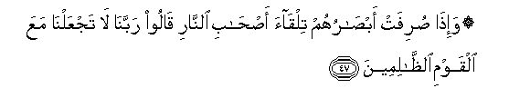

# ۞ وَإِذَا صُرِفَتْ أَبْصَارُهُمْ تِلْقَاءَ أَصْحَابِ النَّارِ قَالُوا رَبَّنَا لَا تَجْعَلْنَا مَعَ الْقَوْمِ الظَّالِمِينَ 

##Wa-itha surifat absaruhum tilqaa as-habi alnnari qaloo rabbana la tajAAalna maAAa alqawmi alththalimeena 

## 翻译(Translation)：

| Translator | 译文(Translation)                                            |
| :--------: | ------------------------------------------------------------ |
|    马坚    | 当他们的眼光转向火狱的居民的时候，他们说：我们的主啊！求你不要使我们与不义的民众同住。 |
|  YUSUFALI  | When their eyes shall be turned towards the Companions of the Fire, they will say: "Our Lord! send us not to the company of the wrong-doers." |
| PICKTHALL  | And when their eyes are turned toward the dwellers of the Fire, they say: Our Lord! Place us not with the wrong-doing folk. |
|   SHAKIR   | And when their eyes shall be turned towards the inmates of the fire, they shall say: Our Lord! place us not with the unjust |

---

## 对位释义(Words Interpretation)：

| No   | العربية | 中文    | English | 曾用词 |
| ---- | ------: | ------- | ------- | ------ |
| 序号 |    阿文 | Chinese | 英文    | Used   |
| 7:47.1  | وَإِذَا     | 和当           | and when        | 见2:11.1   |
| 7:47.2  | صُرِفَتْ     | 它们被转       | they are turned |            |
| 7:47.3  | أَبْصَارُهُمْ  | 他们的众眼     | their eyes      |            |
| 7:47.4  | تِلْقَاءَ    | 一边，方向     | toward          |            |
| 7:47.5  | أَصْحَابِ    | 众居民         | companions      | 见2:119.9  |
| 7:47.6  | النَّارِ    | 火狱           | the Fire        | 见2:24.7   |
| 7:47.7  | قَالُوا    | 他们说，       | They said       | 见2:11.8   |
| 7:47.8  | رَبَّنَا     | 我们的主       | Our Lord        | 见2:127.8  |
| 7:47.9  | لَا       | 不，不是，没有 | no              | 见2:2.3    |
| 7:47.10 | تَجْعَلْنَا   | 你安置我们     | place us        |            |
| 7:47.11 | مَعَ       | 共同           | With            | 见2:43.6   |
| 7:47.12 | الْقَوْمِ    | 人们           | folk            | 见2:250.14 |
| 7:47.13 | الظَّالِمِينَ | 不义的人       | unjust          | 见2:35.19  |

---