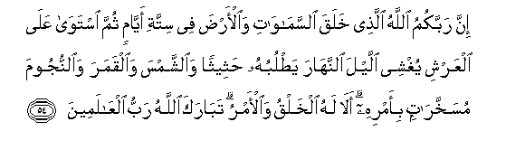

# إِنَّ رَبَّكُمُ اللَّهُ الَّذِي خَلَقَ السَّمَاوَاتِ وَالْأَرْضَ فِي سِتَّةِ أَيَّامٍ ثُمَّ اسْتَوَىٰ عَلَى الْعَرْشِ يُغْشِي اللَّيْلَ النَّهَارَ يَطْلُبُهُ حَثِيثًا وَالشَّمْسَ وَالْقَمَرَ وَالنُّجُومَ مُسَخَّرَاتٍ بِأَمْرِهِ ۗ أَلَا لَهُ الْخَلْقُ وَالْأَمْرُ ۗ تَبَارَكَ اللَّهُ رَبُّ الْعَالَمِينَ 

##Inna rabbakumu Allahu allathee khalaqa alssamawati waal-arda fee sittati ayyamin thumma istawa AAalaalAAarshi yughshee allayla alnnahara yatlubuhu hatheethan waalshshamsa waalqamara waalnnujooma musakhkharatin bi-amrihi ala lahu alkhalqu waal-amru tabaraka Allahu rabbu alAAalameena 

## 翻译(Translation)：

| Translator | 译文(Translation)                                            |
| :--------: | ------------------------------------------------------------ |
|    马坚    | 你们的主确是真主，他在6日内创造了天地，然后，升上宝座，他使黑夜追求白昼，而遮蔽它；他把日月和星宿造成顺从他的命令的。真的，创造和命令只归他主持。多福哉真主--全世界的主！ |
|  YUSUFALI  | Your Guardian-Lord is Allah, Who created the heavens and the earth in six days, and is firmly established on the throne (of authority): He draweth the night as a veil o'er the day, each seeking the other in rapid succession: He created the sun, the moon, and the stars, (all) governed by laws under His command. Is it not His to create and to govern? Blessed be Allah, the Cherisher and Sustainer of the worlds! |
| PICKTHALL  | Lo! your Lord is Allah Who created the heavens and the earth in six Days, then mounted He the Throne. He covereth the night with the day, which is in haste to follow it, and hath made the sun and the moon and the stars subservient by His command. His verily is all creation and commandment. Blessed be Allah, the Lord of the Worlds! |
|   SHAKIR   | Surely your Lord is Allah, Who created the heavens and the earth in six periods of time, and He is firm in power; He throws the veil of night over the day, which it pursues incessantly; and (He created) the sun and the moon and the stars, made subservient by His command; surely His is the creation and the command; blessed is Allah, the Lord of the worlds. |

---

## 对位释义(Words Interpretation)：

| No   | العربية | 中文    | English | 曾用词 |
| ---- | ------: | ------- | ------- | ------ |
| 序号 |    阿文 | Chinese | 英文    | Used   |
| 7:54.1  | إِنَّ       | 的确             | surely                | 见2:6.1    |
| 7:54.2  | رَبَّكُمُ     | 你们的主         | Your Lord             | 见2:21.5   |
| 7:54.3  | اللَّهُ     | 安拉，真主       | Allah                 | 见2:7.2    |
| 7:54.4  | الَّذِي     | 谁               | who                   | 见2:17.3   |
| 7:54.5  | خَلَقَ      | 创造             | created               | 见2:29.3   |
| 7:54.6  | السَّمَاوَاتِ | 诸天的           | of the heavens        | 见2:33.16  |
| 7:54.7  | وَالْأَرْضَ   | 和土地           | and earth             | 见2:255.44 |
| 7:54.8  | فِي       | 在               | in                    | 见2:10.1   |
| 7:54.9  | سِتَّةِ      | 六               | six                   |            |
| 7:54.10 | أَيَّامٍ     | 日子             | days                  | 见2:184.12 |
| 7:54.11 | ثُمَّ       | 然后             | Then                  | 见2:28.7   |
| 7:54.12 | اسْتَوَىٰ    | 经营，端坐，升上 | directed Himself to   | 见2:29.10  |
| 7:54.13 | عَلَى      | 至               | On                    | 见2:5.2    |
| 7:54.14 | الْعَرْشِ    | 宝座             | the throne            |            |
| 7:54.15 | يُغْشِي     | 他覆盖           | He covers             |            |
| 7:54.16 | اللَّيْلَ    | 夜               | the night             | 见2:164.7  |
| 7:54.17 | النَّهَارَ   | 白昼             | the day               | 见3:27.6   |
| 7:54.18 | يَطْلُبُهُ    | 它追寻它         | it pursues it         |            |
| 7:54.19 | حَثِيثًا    | 快速地           | in rapid              |            |
| 7:54.20 | وَالشَّمْسَ   | 和太阳           | and the sun           | 见6:96.6   |
| 7:54.21 | وَالْقَمَرَ   | 和月亮           | and the moon          | 见6:96.7   |
| 7:54.22 | وَالنُّجُومَ  | 和诸星           | and the stars         | 参6:97.5   |
| 7:54.23 | مُسَخَّرَاتٍ   | 它们顺从         | they made subservient |            |
| 7:54.24 | بِأَمْرِهِ    | 以他的命令       | with his command      | 见2:109.27 |
| 7:54.25 | أَلَا      | 真的             | now surely            | 见2:12.1   |
| 7:54.26 | لَهُ       | 对他             | for he                | 见2:102.62 |
| 7:54.27 | الْخَلْقُ    | 创造             | to create             |            |
| 7:54.28 | وَالْأَمْرُ   | 和事情           | and the matter        | 参2:210.13 |
| 7:54.29 | تَبَارَكَ    | 多福             | blessed               |            |
| 7:54.30 | اللَّهُ     | 安拉，真主       | Allah                 | 见2:7.2    |
| 7:54.31 | رَبُّ       | 养主             | Lord                  | 见6:164.7  |
| 7:54.32 | الْعَالَمِينَ | 世界，众世界的   | worlds                | 见1:2.4    |

---