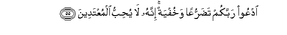

# ادْعُوا رَبَّكُمْ تَضَرُّعًا وَخُفْيَةً ۚ إِنَّهُ لَا يُحِبُّ الْمُعْتَدِينَ 

##OdAAoo rabbakum tadarruAAan wakhufyatan innahu la yuhibbu almuAAtadeena 

## 翻译(Translation)：

| Translator | 译文(Translation)                                            |
| :--------: | ------------------------------------------------------------ |
|    马坚    | 你们要虔诚地、秘密地祈祷你们的主，他确是不喜欢过分者的。     |
|  YUSUFALI  | Call on your Lord with humility and in private: for Allah loveth not those who trespass beyond bounds. |
| PICKTHALL  | (O mankind!) Call upon your Lord humbly and in secret. Lo! He loveth not aggressors. |
|   SHAKIR   | Call on your Lord humbly and secretly; surely He does not love those who exceed the limits. |

---

## 对位释义(Words Interpretation)：

| No   | العربية | 中文    | English | 曾用词 |
| ---- | ------: | ------- | ------- | ------ |
| 序号 |    阿文 | Chinese | 英文    | Used   |
| 7:55.1 | ادْعُوا    | 你们应祈祷     | Call on                     |            |
| 7:55.2 | رَبَّكُمْ     | 你们的养主     | your Lord                   |            |
| 7:55.3 | تَضَرُّعًا    | 谦卑的         | humbly                      | 见6:63.9   |
| 7:55.4 | وَخُفْيَةً    | 和秘密的       | and in secret               | 见6:63.10  |
| 7:55.5 | إِنَّهُ      | 确实他         | he is                       | 见2:37.8   |
| 7:55.6 | لَا       | 不，不是，没有 | no                          | 见2:2.3    |
| 7:55.7 | يُحِبُّ      | 喜欢           | love                        | 见2:190.12 |
| 7:55.8 | الْمُعْتَدِينَ | 过分者         | those who exceed the limits | 见2:190.13 |

---