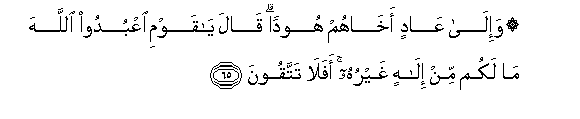

# ۞ وَإِلَىٰ عَادٍ أَخَاهُمْ هُودًا ۗ قَالَ يَا قَوْمِ اعْبُدُوا اللَّهَ مَا لَكُمْ مِنْ إِلَٰهٍ غَيْرُهُ ۚ أَفَلَا تَتَّقُونَ 

##Wa-ila AAadin akhahum hoodan qala ya qawmi oAAbudoo Allaha ma lakum min ilahin ghayruhu afalatattaqoona 

## 翻译(Translation)：

| Translator | 译文(Translation)                                            |
| :--------: | ------------------------------------------------------------ |
|    马坚    | （我确已派遣）阿德人的弟兄呼德去教化他们，他说：我的宗族啊！你们要崇拜真主，除他之外，绝无应受你们崇拜的。难道你们还不敬畏吗？ |
|  YUSUFALI  | To the 'Ad people, (We sent) Hud, one of their (own) brethren: He said: O my people! worship Allah! ye have no other god but Him will ye not fear (Allah)?" |
| PICKTHALL  | And unto (the tribe of) A'ad (We sent) their brother, Hud. He said: O my people! Serve Allah. Ye have no other Allah save Him. Will ye not ward off (evil)? |
|   SHAKIR   | And to Ad (We sent) their brother Hud. He said: O my people! serve Allah, you have no god other than Him; will you not then guard (against evil)? |

---

## 对位释义(Words Interpretation)：

| No   | العربية | 中文    | English | 曾用词 |
| ---- | ------: | ------- | ------- | ------ |
| 序号 |    阿文 | Chinese | 英文    | Used   |
| 7:65.1  | وَإِلَىٰ   | 和至             | and to              | 见4:83.14  |
| 7:65.2  | عَادٍ    | 过分的（阿德人） | transgressing（Ad） | 见2:173.18 |
| 7:65.3  | أَخَاهُمْ  | 他们的弟兄       | their brother       |            |
| 7:65.4  | هُودًا   | 犹太教徒（呼德） | a Jew（Hud）        | 见2:111.8  |
| 7:65.5  | قَالَ    | 他说，           | He said             | 见2:30.2   |
| 7:65.6  | يَا     | 啊               | Oh                  | 见2:21.1   |
| 7:65.7  | قَوْمِ    | 我的宗族         | my people           | 见2:54.6   |
| 7:65.8  | اعْبُدُوا | 崇拜             | Worship             | 见2:21.4   |
| 7:65.9  | اللَّهَ   | 安拉，真主       | Allah               | 见2:9.2    |
| 7:65.10 | مَا     | 不               | not                 | 见2:120.24 |
| 7:65.11 | لَكُمْ    | 为你们           | For you             | 见2:22.3   |
| 7:65.12 | مِنْ     | 从               | from                | 见2:4.8    |
| 7:65.13 | إِلَٰهٍ    | 主宰             | Allah               | 见3:62.8   |
| 7:65.14 | غَيْرُهُ   | 他之外           | other than him      | 见7:59.15  |
| 7:65.15 | أَفَلَا   | 岂不             | will not            | 见2:44.9   |
| 7:65.16 | تَتَّقُونَ  | 敬畏             | Cautious            | 见2:21.12  |

---