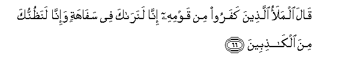

# قَالَ الْمَلَأُ الَّذِينَ كَفَرُوا مِنْ قَوْمِهِ إِنَّا لَنَرَاكَ فِي سَفَاهَةٍ وَإِنَّا لَنَظُنُّكَ مِنَ الْكَاذِبِينَ 

##Qala almalao allatheena kafaroo min qawmihi inna lanaraka fee safahatin wa-inna lanathunnuka mina alkathibeena 

## 翻译(Translation)：

| Translator | 译文(Translation)                                            |
| :--------: | ------------------------------------------------------------ |
|    马坚    | 他的宗族中不信道的贵族们说：我们的确认为你是愚蠢的，我们确信你是说谎者。 |
|  YUSUFALI  | The leaders of the Unbelievers among his people said: "Ah! we see thou art an imbecile!" and "We think thou art a liar!" |
| PICKTHALL  | The chieftains of his people, who were disbelieving, said: Lo! we surely see thee in foolishness, and lo! we deem thee of the liars. |
|   SHAKIR   | The chiefs of those who disbelieved from among his people said: Most surely we see you in folly, and most surely we think you to be of the liars. |

---

## 对位释义(Words Interpretation)：

| No   | العربية | 中文    | English | 曾用词 |
| ---- | ------: | ------- | ------- | ------ |
| 序号 |    阿文 | Chinese | 英文    | Used   |
| 7:66.1  | قَالَ      | 他说，         | He said             | 见2:30.2  |
| 7:66.2  | الْمَلَأُ    | 众领袖         | The leaders         | 见7:60.2  |
| 7:66.3  | الَّذِينَ    | 谁，那些       | those who           | 见2:6.2   |
| 7:66.4  | كَفَرُوا    | 不信           | disbelieve          | 见2:6.3   |
| 7:66.5  | مِنْ       | 从             | from                | 见2:4.8   |
| 7:66.6  | قَوْمِهِ     | 他的宗族       | his people          | 见6:83.6  |
| 7:66.7  | إِنَّا      | 确实我们       | surely we           | 见2:14.12 |
| 7:66.8  | لَنَرَاكَ    | 必定我们看你   | surely we see you   | 见7:60.6  |
| 7:66.9  | فِي       | 在             | in                  | 见2:10.1  |
| 7:66.10 | سَفَاهَةٍ    | 愚蠢的         | foolishness         |           |
| 7:66.11 | وَإِنَّا     | 和我们         | and we              | 见2:70.13 |
| 7:66.12 | لَنَظُنُّكَ    | 必定我们认为你 | surely we think you |           |
| 7:66.13 | مِنَ       | 从             | from                | 见2:19.3  |
| 7:66.14 | الْكَاذِبِينَ | 众说谎者       | the liars           | 见3:61.25 |

---