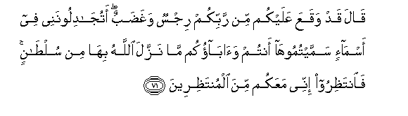

# قَالَ قَدْ وَقَعَ عَلَيْكُمْ مِنْ رَبِّكُمْ رِجْسٌ وَغَضَبٌ ۖ أَتُجَادِلُونَنِي فِي أَسْمَاءٍ سَمَّيْتُمُوهَا أَنْتُمْ وَآبَاؤُكُمْ مَا نَزَّلَ اللَّهُ بِهَا مِنْ سُلْطَانٍ ۚ فَانْتَظِرُوا إِنِّي مَعَكُمْ مِنَ الْمُنْتَظِرِينَ 

##Qala qad waqaAAa AAalaykum min rabbikum rijsun waghadabun atujadiloonanee fee asma-in sammaytumoohaantum waabaokum ma nazzala Allahu biha min sultanin faintathiroo innee maAAakum mina almuntathireena 

## 翻译(Translation)：

| Translator | 译文(Translation)                                            |
| :--------: | ------------------------------------------------------------ |
|    马坚    | 他说：刑罚和谴怒，必从你们的主来临你们。你们和你们的祖先所定的许多名称，真主并未加以证实，难道你们要为那些名称与我争论吗？你们等待着吧！我的确是与你们一起等待的。 |
|  YUSUFALI  | He said: "Punishment and wrath have already come upon you from your Lord: dispute ye with me over names which ye have devised - ye and your fathers,- without authority from Allah? then wait: I am amongst you, also waiting." |
| PICKTHALL  | He said: Terror and wrath from your Lord have already fallen on you. Would ye wrangle with me over names which ye have named, ye and your fathers, for which no warrant from Allah hath been revealed? Then await (the consequence), lo! I (also) am of those awaiting (it). |
|   SHAKIR   | He said: Indeed uncleanness and wrath from your Lord have lighted upon you; what! do you dispute with me about names which you and your fathers have given? Allah has not sent any authority for them; wait then, I too with you will be of those who wait. |

---

## 对位释义(Words Interpretation)：

| No   | العربية | 中文    | English | 曾用词 |
| ---- | ------: | ------- | ------- | ------ |
| 序号 |    阿文 | Chinese | 英文    | Used   |
| 7:71.1  | قَالَ        | 他说，           | He said                  | 见2:30.2   |
| 7:71.2  | قَدْ         | 当然             | may                      | 见2:60.14  |
| 7:71.3  | وَقَعَ        | 它降临           | it have fallen           | 见4:100.24 |
| 7:71.4  | عَلَيْكُمْ      | 在你们           | on you                   | 见2:40.8   |
| 7:71.5  | مِنْ         | 从               | from                     | 见2:4.8    |
| 7:71.6  | رَبِّكُمْ       | 你们的主         | Your Lord                | 见2:21.5   |
| 7:71.7  | رِجْسٌ        | 不洁净           | an uncleanness           | 见5:90.10  |
| 7:71.8  | وَغَضَبٌ       | 和谴怒           | and wrath                |            |
| 7:71.9  | أَتُجَادِلُونَنِي | 你们与我争论吗？ | do you dispute with me？ |            |
| 7:71.10 | فِي         | 在               | in                       | 见2:10.1   |
| 7:71.11 | أَسْمَاءٍ      | 众名字           | names                    |            |
| 7:71.12 | سَمَّيْتُمُوهَا   | 你们命名它       | you have named it        |            |
| 7:71.13 | أَنْتُمْ       | 你们             | you                      | 见2:85.2   |
| 7:71.14 | وَآبَاؤُكُمْ    | 和你的父母亲     | and your parents         | 参4:11.56  |
| 7:71.15 | مَا         | 不               | not                      | 见2:120.24 |
| 7:71.16 | نَزَّلَ        | 降示             | sent down                | 见2:176.4  |
| 7:71.17 | اللَّهُ       | 安拉，真主       | Allah                    | 见2:7.2    |
| 7:71.18 | بِهَا        | 在他们           | in them                  | 见2:99.8   |
| 7:71.19 | مِنْ         | 从               | from                     | 见2:4.8    |
| 7:71.20 | سُلْطَانٍ      | 证实             | authority                |            |
| 7:71.21 | فَانْتَظِرُوا   | 因此你们等待     | then wait you            | 参6:158.35 |
| 7:71.22 | إِنِّي        | 确实我           | surely I                 | 见2:30.5   |
| 7:71.23 | مَعَكُمْ       | 随着你           | With you                 | 见2:14.13  |
| 7:71.24 | مِنَ         | 从               | from                     | 见2:19.3   |
| 7:71.25 | الْمُنْتَظِرِينَ  | 众等待者         | those awaiting           |            |

---