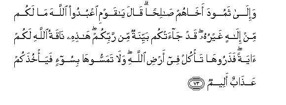

# وَإِلَىٰ ثَمُودَ أَخَاهُمْ صَالِحًا ۗ قَالَ يَا قَوْمِ اعْبُدُوا اللَّهَ مَا لَكُمْ مِنْ إِلَٰهٍ غَيْرُهُ ۖ قَدْ جَاءَتْكُمْ بَيِّنَةٌ مِنْ رَبِّكُمْ ۖ هَٰذِهِ نَاقَةُ اللَّهِ لَكُمْ آيَةً ۖ فَذَرُوهَا تَأْكُلْ فِي أَرْضِ اللَّهِ ۖ وَلَا تَمَسُّوهَا بِسُوءٍ فَيَأْخُذَكُمْ عَذَابٌ أَلِيمٌ 

##Wa-ila thamooda akhahum salihan qala ya qawmi oAAbudoo Allaha ma lakum min ilahin ghayruhu qad jaatkum bayyinatun min rabbikum hathihi naqatu Allahi lakum ayatan fatharooha ta/kul fee ardi Allahi wala tamassoohabisoo-in faya/khuthakum AAathabun aleemun 

## 翻译(Translation)：

| Translator | 译文(Translation)                                            |
| :--------: | ------------------------------------------------------------ |
|    马坚    | （我确已派遣）赛莫德人的弟兄撒立哈去教化他们，他说：我的宗族啊！你们要崇拜真主，除他之外，绝无应受你们崇拜的。从你们的主发出的明证确已降临你们，这只真主的母驼可以作你们的迹象。故你们让它在真主的大地上随便吃草，不要伤害它，否则，痛苦的刑罚必袭击你们。 |
|  YUSUFALI  | To the Thamud people (We sent) Salih, one of their own brethren: He said: "O my people! worship Allah: ye have no other god but Him. Now hath come unto you a clear (Sign) from your Lord! This she-camel of Allah is a Sign unto you: So leave her to graze in Allah's earth, and let her come to no harm, or ye shall be seized with a grievous punishment. |
| PICKTHALL  | And to (the tribe of) Thamud (We sent) their brother Salih. He said: O my people! Serve Allah. Ye have no other Allah save Him. A wonder from your Lord hath come unto you. Lo! this is the camel of Allah, a token unto you; so let her feed in Allah's earth, and touch her not with hurt lest painful torment seize you. |
|   SHAKIR   | And to Samood (We sent) their brother Salih. He said: O my people! serve Allah, you have no god other than Him; clear proof indeed has come to you from your Lord; this is (as) Allah's she-camel for you-- a sign, therefore leave her alone to pasture on Allah's earth, and do not touch her with any harm, otherwise painful chastisement will overtake you. |

---

## 对位释义(Words Interpretation)：

| No   | العربية | 中文    | English | 曾用词 |
| ---- | ------: | ------- | ------- | ------ |
| 序号 |    阿文 | Chinese | 英文    | Used   |
| 7:73.1  | وَإِلَىٰ    | 和至           | and to                 | 见4:83.14  |
| 7:73.2  | ثَمُودَ    | 赛莫德         | the Thamud             |            |
| 7:73.3  | أَخَاهُمْ   | 他们的弟兄     | their brother          | 见7:65.3   |
| 7:73.4  | صَالِحًا   | 善功（撒立哈） | good(Salih)            | 见2:62.14  |
| 7:73.5  | قَالَ     | 他说，         | He said                | 见2:30.2   |
| 7:73.6  | يَا      | 啊             | Oh                     | 见2:21.1   |
| 7:73.7  | قَوْمِ     | 我的宗族       | my people              | 见2:54.6   |
| 7:73.8  | اعْبُدُوا  | 崇拜           | Worship                | 见2:21.4   |
| 7:73.9  | اللَّهَ    | 安拉，真主     | Allah                  | 见2:9.2    |
| 7:73.10 | مَا      | 不             | not                    | 见2:120.24 |
| 7:73.11 | لَكُمْ     | 为你们         | For you                | 见2:22.3   |
| 7:73.12 | مِنْ      | 从             | from                   | 见2:4.8    |
| 7:73.13 | إِلَٰهٍ     | 主宰           | Allah                  | 见3:62.8   |
| 7:73.14 | غَيْرُهُ    | 他之外         | other than him         | 见7:59.15  |
| 7:73.15 | قَدْ      | 当然           | may                    | 见2:60.14  |
| 7:73.16 | جَاءَتْكُمْ  | 它来到你们     | it has come to you     |            |
| 7:73.17 | بَيِّنَةٌ    | 明证           | a clear proof          | 见6:157.13 |
| 7:73.18 | مِنْ      | 从             | from                   | 见2:4.8    |
| 7:73.19 | رَبِّكُمْ    | 你们的主       | Your Lord              | 见2:21.5   |
| 7:73.20 | هَٰذِهِ     | 这个           | this                   | 见2:35.15  |
| 7:73.21 | نَاقَةُ    | 母骆驼         | she-camel              |            |
| 7:73.22 | اللَّهِ    | 真主的         | of Allah               | 见2:23.17  |
| 7:73.23 | لَكُمْ     | 为你们         | For you                | 见2:22.3   |
| 7:73.24 | آيَةً     | 一个迹象       | a sign                 | 见2:259.47 |
| 7:73.25 | فَذَرُوهَا  | 因此你们让她   | so let her             |            |
| 7:73.26 | تَأْكُلْ    | 她吃           | she graze              |            |
| 7:73.27 | فِي      | 在             | in                     | 见2:10.1   |
| 7:73.28 | أَرْضِ     | 大地           | earth                  |            |
| 7:73.29 | اللَّهِ    | 真主的         | of Allah               | 见2:23.17  |
| 7:73.30 | وَلَا     | 也不           | and not                | 见1:7.8    |
| 7:73.31 | تَمَسُّوهَا  | 你们接触她     | you touch her          |            |
| 7:73.32 | بِسُوءٍ    | 在伤害         | with harm              | 参3:30.13  |
| 7:73.33 | فَيَأْخُذَكُمْ | 因此它袭击你们 | then it will seize you |            |
| 7:73.34 | عَذَابٌ    | 煎熬，刑罚     | torment, punishment    | 见2:7.11   |
| 7:73.35 | أَلِيمٌ    | 痛苦，疼痛     | A painful              | 见2:10.9   |

---