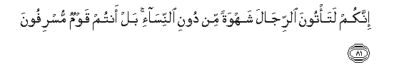

# إِنَّكُمْ لَتَأْتُونَ الرِّجَالَ شَهْوَةً مِنْ دُونِ النِّسَاءِ ۚ بَلْ أَنْتُمْ قَوْمٌ مُسْرِفُونَ 

##Innakum lata/toona alrrijala shahwatan min dooni alnnisa-i bal antum qawmun musrifoona 

## 翻译(Translation)：

| Translator | 译文(Translation)                                            |
| :--------: | ------------------------------------------------------------ |
|    马坚    | 你们一定要舍妇女而以男人满足性欲，你们确是过分的民众。       |
|  YUSUFALI  | "For ye practise your lusts on men in preference to women : ye are indeed a people transgressing beyond bounds." |
| PICKTHALL  | Lo! ye come with lust unto men instead of women. Nay, but ye are wanton folk. |
|   SHAKIR   | Most surely you come to males in lust besides females; nay you are an extravagant people. |

---

## 对位释义(Words Interpretation)：

| No   | العربية | 中文    | English | 曾用词 |
| ---- | ------: | ------- | ------- | ------ |
| 序号 |    阿文 | Chinese | 英文    | Used   |
| 7:81.1  | إِنَّكُمْ   | 你们确实     | surely you         | 见2:54.7  |
| 7:81.2  | لَتَأْتُونَ | 必定你们贪恋 | surely you come to |           |
| 7:81.3  | الرِّجَالَ | 众男人       | men                |           |
| 7:81.4  | شَهْوَةً   | 色欲         | lust               |           |
| 7:81.5  | مِنْ     | 从           | from               | 见2:4.8   |
| 7:81.6  | دُونِ    | 之外         | Without            | 见2:23.16 |
| 7:81.7  | النِّسَاءِ | 妇女们的     | of women           | 见2:235.9 |
| 7:81.8  | بَلْ     | 不然         | Nay, but           | 见2:88.4  |
| 7:81.9  | أَنْتُمْ   | 你们         | you                | 见2:85.2  |
| 7:81.10 | قَوْمٌ    | 一伙人       | a people           | 见5:11.11 |
| 7:81.11 | مُسْرِفُونَ | 过分的       | extravagant        |           |

---