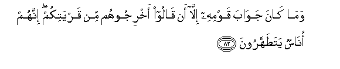

# وَمَا كَانَ جَوَابَ قَوْمِهِ إِلَّا أَنْ قَالُوا أَخْرِجُوهُمْ مِنْ قَرْيَتِكُمْ ۖ إِنَّهُمْ أُنَاسٌ يَتَطَهَّرُونَ 

##Wama kana jawaba qawmihi illa an qaloo akhrijoohum min qaryatikum innahum onasun yatatahharoona 

## 翻译(Translation)：

| Translator | 译文(Translation)                                            |
| :--------: | ------------------------------------------------------------ |
|    马坚    | 他的宗族唯一的答覆是说：你们把他们逐出城外，因为他们确是纯洁的民众！ |
|  YUSUFALI  | And his people gave no answer but this: they said, "Drive them out of your city: these are indeed men who want to be clean and pure!" |
| PICKTHALL  | And the answer of his people was only that they said (one to another): Turn them out of your township. They are folk, forsooth, who keep pure. |
|   SHAKIR   | And the answer of his people was no other than that they said: Turn them out of your town, surely they are a people who seek to purify (themselves). |

---

## 对位释义(Words Interpretation)：

| No   | العربية | 中文    | English | 曾用词 |
| ---- | ------: | ------- | ------- | ------ |
| 序号 |    阿文 | Chinese | 英文    | Used   |
| 7:82.1  | وَمَا     | 和不         | And not        | 见2:9.9  |
| 7:82.2  | كَانَ     | 他是         | It was         | 见2:75.6 |
| 7:82.3  | جَوَابَ    | 回答         | answer         |          |
| 7:82.4  | قَوْمِهِ    | 他的宗族     | his people     | 见6:83.6 |
| 7:82.5  | إِلَّا     | 除了         | Except         | 见2:9.7  |
| 7:82.6  | أَنْ      | 该           | that           | 见2:26.5 |
| 7:82.7  | قَالُوا   | 他们说，     | They said      | 见2:11.8 |
| 7:82.8  | أَخْرِجُوهُمْ | 你们驱逐他们 | Drive them out |          |
| 7:82.9  | مِنْ      | 从           | from           | 见2:4.8  |
| 7:82.10 | قَرْيَتِكُمْ  | 你们的城镇   | your city      |          |
| 7:82.11 | إِنَّهُمْ    | 确实他们     | that they      | 见2:12.2 |
| 7:82.12 | أُنَاسٌ    | 民众         | people         |          |
| 7:82.13 | يَتَطَهَّرُونَ | 他们纯洁     | they are pure  |          |

---