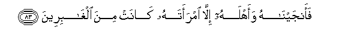

# فَأَنْجَيْنَاهُ وَأَهْلَهُ إِلَّا امْرَأَتَهُ كَانَتْ مِنَ الْغَابِرِينَ 

##Faanjaynahu waahlahu illa imraatahu kanat mina alghabireena 

## 翻译(Translation)：

| Translator | 译文(Translation)                                            |
| :--------: | ------------------------------------------------------------ |
|    马坚    | 我拯救了他和他的信徒，没有拯救他的女人，她是和其余的人同受刑罚的。 |
|  YUSUFALI  | But we saved him and his family, except his wife: she was of those who legged behind. |
| PICKTHALL  | And We rescued him and his household, save his wife, who was of those who stayed behind. |
|   SHAKIR   | So We delivered him and his followers, except his wife; she was of those who remained behind. |

---

## 对位释义(Words Interpretation)：

| No   | العربية | 中文    | English | 曾用词 |
| ---- | ------: | ------- | ------- | ------ |
| 序号 |    阿文 | Chinese | 英文    | Used   |
| 7:83.1 | فَأَنْجَيْنَاهُ | 因此我们拯救他 | so We saved him           | 见7:64.2   |
| 7:83.2 | وَأَهْلَهُ    | 和他的人们     | and his people            | 参2:126.10 |
| 7:83.3 | إِلَّا      | 除了           | Except                    | 见2:9.7    |
| 7:83.4 | امْرَأَتَهُ   | 他的女人       | his wife                  |            |
| 7:83.5 | كَانَتْ     | 她是           | she was                   | 见2:94.3   |
| 7:83.6 | مِنَ       | 从             | from                      | 见2:19.3   |
| 7:83.7 | الْغَابِرِينَ | 众落后者       | those who remained behind |            |

---