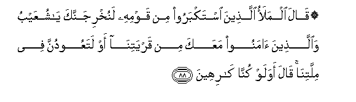

# ۞ قَالَ الْمَلَأُ الَّذِينَ اسْتَكْبَرُوا مِنْ قَوْمِهِ لَنُخْرِجَنَّكَ يَا شُعَيْبُ وَالَّذِينَ آمَنُوا مَعَكَ مِنْ قَرْيَتِنَا أَوْ لَتَعُودُنَّ فِي مِلَّتِنَا ۚ قَالَ أَوَلَوْ كُنَّا كَارِهِينَ 

##Qala almalao allatheena istakbaroo min qawmihi lanukhrijannaka ya shuAAaybu waallatheena amanoo maAAaka min qaryatina aw lataAAoodunna fee millatina qala awa law kunna kariheena 

## 翻译(Translation)：

| Translator | 译文(Translation)                                            |
| :--------: | ------------------------------------------------------------ |
|    马坚    | 他的宗族中骄傲的贵族们说：舒阿卜啊！我们一定要把你和你的信徒们逐出城外，除非你们再信我们的宗教。他说：即使我们厌恶你们的宗教，也要我们再信奉它吗？ |
|  YUSUFALI  | The leaders, the arrogant party among his people, said: "O Shu'aib! we shall certainly drive thee out of our city - (thee) and those who believe with thee; or else ye (thou and they) shall have to return to our ways and religion." He said: "What! even though we do detest (them)? |
| PICKTHALL  | The chieftains of his people, who were scornful, said: Surely we will drive thee out, O Shu'eyb, and those who believe with thee, from our township, unless ye return to our religion. He said: Even though we hate it? |
|   SHAKIR   | The chiefs, those who were proud from among his people said: We will most certainly turn you out, O Shu'aib, and (also; those who believe with you, from our town, or you shall come back to our faith. He said: What! though we dislike (it)? |

---

## 对位释义(Words Interpretation)：

| No   | العربية | 中文    | English | 曾用词 |
| ---- | ------: | ------- | ------- | ------ |
| 序号 |    阿文 | Chinese | 英文    | Used   |
| 7:88.1  | قَالَ      | 他说，         | He said                      | 见2:30.2   |
| 7:88.2  | الْمَلَأُ    | 众领袖         | The leaders                  | 见7:60.2   |
| 7:88.3  | الَّذِينَ    | 谁，那些       | those who                    | 见2:6.2    |
| 7:88.4  | اسْتَكْبَرُوا | 他们骄傲       | they were proudly            | 见7:75.4   |
| 7:88.5  | مِنْ       | 从             | from                         | 见2:4.8    |
| 7:88.6  | قَوْمِهِ     | 他的宗族       | his people                   | 见6:83.6   |
| 7:88.7  | لَنُخْرِجَنَّكَ  | 必定我们驱逐你 | Surely we will drive you out |            |
| 7:88.8  | يَا       | 啊             | Oh                           | 见2:21.1   |
| 7:88.9  | شُعَيْبُ     | 舒阿卜         | Shu'aib                      |            |
| 7:88.10 | وَالَّذِينَ   | 和那些         | and those who                | 见2:21.8   |
| 7:88.11 | آمَنُوا    | 诚信           | believe                      | 见2:9.4    |
| 7:88.12 | مَعَكَ      | 与你共同       | with you                     | 见4:102.10 |
| 7:88.13 | مِنْ       | 从             | from                         | 见2:4.8    |
| 7:88.14 | قَرْيَتِنَا   | 我们的城镇     | our town                     |            |
| 7:88.15 | أَوْ       | 或             | or                           | 见2:19.1   |
| 7:88.16 | لَتَعُودُنَّ   | 你们必定返回   | you shall come back          |            |
| 7:88.17 | فِي       | 在             | in                           | 见2:10.1   |
| 7:88.18 | مِلَّتِنَا    | 我们的宗教     | our religion                 |            |
| 7:88.19 | قَالَ      | 他说，         | He said                      | 见2:30.2   |
| 7:88.20 | أَوَلَوْ     | 什么？和假如   | What! and though             | 见2:170.15 |
| 7:88.21 | كُنَّا      | 我们是         | We were                      | 见4:97.11  |
| 7:88.22 | كَارِهِينَ   | 厌恶           | dislike                      |            |

---