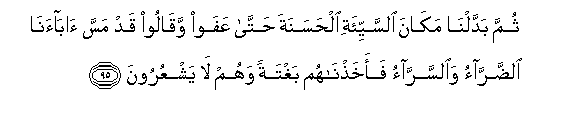

# ثُمَّ بَدَّلْنَا مَكَانَ السَّيِّئَةِ الْحَسَنَةَ حَتَّىٰ عَفَوْا وَقَالُوا قَدْ مَسَّ آبَاءَنَا الضَّرَّاءُ وَالسَّرَّاءُ فَأَخَذْنَاهُمْ بَغْتَةً وَهُمْ لَا يَشْعُرُونَ 

##Thumma baddalna makana alssayyi-ati alhasanata hatta AAafaw waqaloo qad massa abaana alddarrao waalssarrao faakhathnahum baghtatan wahum la yashAAuroona 

## 翻译(Translation)：

| Translator | 译文(Translation)                                            |
| :--------: | ------------------------------------------------------------ |
|    马坚    | 随后我转祸为福，直到他们富庶，并且说：我们的祖先确已遭过患难，享过康乐了。于是，当他们不知不觉时，我惩治他们。 |
|  YUSUFALI  | Then We changed their suffering into prosperity, until they grew and multiplied, and began to say: "Our fathers (too) were touched by suffering and affluence" ... Behold! We called them to account of a sudden, while they realised not (their peril). |
| PICKTHALL  | Then changed We the evil plight for good till they grew affluent and said: Tribulation and distress did touch our fathers. Then We seized them unawares, when they perceived not. |
|   SHAKIR   | Then We gave them good in the place of evil until they became many and said: Distress and happiness did indeed befall our fathers. Then We took them by surprise while they did not perceive. |

---

## 对位释义(Words Interpretation)：

| No   | العربية | 中文    | English | 曾用词 |
| ---- | ------: | ------- | ------- | ------ |
| 序号 |    阿文 | Chinese | 英文    | Used   |
| 7:95.1  | ثُمَّ       | 然后             | Then                   | 见2:28.7   |
| 7:95.2  | بَدَّلْنَا    | 我们改变         | We changed             |            |
| 7:95.3  | مَكَانَ     | 位置             | place                  | 见4:20.5   |
| 7:95.4  | السَّيِّئَةِ   | 祸的             | the evil               |            |
| 7:95.5  | الْحَسَنَةَ   | 福               | the good               |            |
| 7:95.6  | حَتَّىٰ      | 直到             | Until                  | 见2:55.8   |
| 7:95.7  | عَفَوْا     | 他们富庶         | they grew affluent     |            |
| 7:95.8  | وَقَالُوا   | 和他们说         | and they say           | 见2:80.1   |
| 7:95.9  | قَدْ       | 当然             | may                    | 见2:60.14  |
| 7:95.10 | مَسَّ       | 接触             | touch                  | 见3:140.5  |
| 7:95.11 | آبَاءَنَا   | 我们的祖先       | our fathers            | 见2:170.14 |
| 7:95.12 | الضَّرَّاءُ   | 患难             | distress               |            |
| 7:95.13 | وَالسَّرَّاءُ  | 和康乐           | and happiness          |            |
| 7:95.14 | فَأَخَذْنَاهُمْ | 然后我们惩治他们 | then We afflicted them | 见6:42.7   |
| 7:95.15 | بَغْتَةً     | 突然地           | a sudden               | 见6:31.11  |
| 7:95.16 | وَهُمْ      | 和他们           | and in them            | 见2:25.32  |
| 7:95.17 | لَا       | 不，不是，没有   | no                     | 见2:2.3    |
| 7:95.18 | يَشْعُرُونَ   | 感觉，觉悟       | they feel, realize     | 见2:9.10   |

---