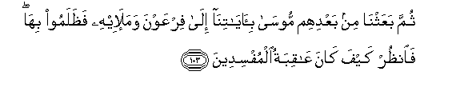

# ثُمَّ بَعَثْنَا مِنْ بَعْدِهِمْ مُوسَىٰ بِآيَاتِنَا إِلَىٰ فِرْعَوْنَ وَمَلَئِهِ فَظَلَمُوا بِهَا ۖ فَانْظُرْ كَيْفَ كَانَ عَاقِبَةُ الْمُفْسِدِينَ 

##Thumma baAAathna min baAAdihim moosa bi-ayatina ila firAAawna wamala-ihi fathalamoo biha faonuthur kayfa kana AAaqibatu almufsideena 

## 翻译(Translation)：

| Translator | 译文(Translation)                                            |
| :--------: | ------------------------------------------------------------ |
|    马坚    | 后来，我派遣穆萨带著我的许多迹象，去见法老和他的众公卿，但他们不肯信那些迹象，你看看作恶者的结局是怎样的！ |
|  YUSUFALI  | Then after them We sent Moses with Our signs to Pharaoh and his chiefs, but they wrongfully rejected them: So see what was the end of those who made mischief. |
| PICKTHALL  | Then, after them, We sent Moses with our tokens unto Pharaoh and his chiefs, but they repelled them. Now, see the nature of the consequence for the corrupters! |
|   SHAKIR   | Then we raised after them Musa with Our communications to Firon and his chiefs, but they disbelieved in them; consider then what was the end of the mischief makers. |

---

## 对位释义(Words Interpretation)：

| No   | العربية | 中文    | English | 曾用词 |
| ---- | ------: | ------- | ------- | ------ |
| 序号 |    阿文 | Chinese | 英文    | Used   |
| 7:103.1  | ثُمَّ       | 然后         | Then                 | 见2:28.7   |
| 7:103.2  | بَعَثْنَا    | 我们派遣     | We sent              |            |
| 7:103.3  | مِنْ       | 从           | from                 | 见2:4.8    |
| 7:103.4  | بَعْدِهِمْ    | 他们之后     | after them           | 见2:253.29 |
| 7:103.5  | مُوسَىٰ     | 穆萨         | Moses                | 见2:51.3   |
| 7:103.6  | بِآيَاتِنَا  | 在我们的迹象 | in Our signs         | 见2:39.4   |
| 7:103.7  | إِلَىٰ      | 至           | to                   | 见2:14.9   |
| 7:103.8  | فِرْعَوْنَ    | 法老         | Pharaoh              | 见2:49.5   |
| 7:103.9  | وَمَلَئِهِ    | 和他的众公卿 | and his chiefs       |            |
| 7:103.10 | فَظَلَمُوا   | 但是他们不信 | but they disbelieved |            |
| 7:103.11 | بِهَا      | 在他们       | in them              | 见2:99.8   |
| 7:103.12 | فَانْظُرْ    | 因此你看     | then look            | 见2:259.37 |
| 7:103.13 | كَيْفَ      | 如何         | How                  | 见2:28.1   |
| 7:103.14 | كَانَ      | 他是         | It was               | 见2:75.6   |
| 7:103.15 | عَاقِبَةُ    | 结局         | the consequence      | 见3:137.12 |
| 7:103.16 | الْمُفْسِدِينَ | 众作恶者     | the mischief-makers  | 见5:64.47  |

---