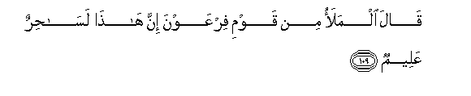

# قَالَ الْمَلَأُ مِنْ قَوْمِ فِرْعَوْنَ إِنَّ هَٰذَا لَسَاحِرٌ عَلِيمٌ 

##Qala almalao min qawmi firAAawna inna hatha lasahirun AAaleemun 

## 翻译(Translation)：

| Translator | 译文(Translation)                                            |
| :--------: | ------------------------------------------------------------ |
|    马坚    | 法老的百姓中的众领袖说：这确是一个高明的术士，               |
|  YUSUFALI  | Said the Chiefs of the people of Pharaoh: "This is indeed a sorcerer well-versed. |
| PICKTHALL  | The chiefs of Pharaoh's people said: Lo! this is some knowing wizard, |
|   SHAKIR   | The chiefs of Firon's people said: most surely this is an enchanter possessed of knowledge: |

---

## 对位释义(Words Interpretation)：

| No   | العربية | 中文    | English | 曾用词 |
| ---- | ------: | ------- | ------- | ------ |
| 序号 |    阿文 | Chinese | 英文    | Used   |
| 7:109.1 | قَالَ   | 他说，       | He said           | 见2:30.2  |
| 7:109.2 | الْمَلَأُ | 众领袖       | The leaders       | 见7:60.2  |
| 7:109.3 | مِنْ    | 从           | from              | 见2:4.8   |
| 7:109.4 | قَوْمِ   | 我的宗族     | my people         | 见2:54.6  |
| 7:109.5 | فِرْعَوْنَ | 法老         | Pharaoh           | 见2:49.5  |
| 7:109.6 | إِنَّ    | 的确         | surely            | 见2:6.1   |
| 7:109.7 | هَٰذَا   | 这个，此     | This              | 见2:25.20 |
| 7:109.8 | لَسَاحِرٌ | 必定一个术士 | indeed a sorcerer |           |
| 7:109.9 | عَلِيمٌ  | 全知的       | Knowing           | 见2:29.19 |

---