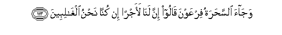

# وَجَاءَ السَّحَرَةُ فِرْعَوْنَ قَالُوا إِنَّ لَنَا لَأَجْرًا إِنْ كُنَّا نَحْنُ الْغَالِبِينَ 

##Wajaa alssaharatu firAAawna qaloo inna lana laajran in kunna nahnu alghalibeena 

## 翻译(Translation)：

| Translator | 译文(Translation)                                            |
| :--------: | ------------------------------------------------------------ |
|    马坚    | 术士们来见法老，他们说：如果我们获胜，我们会得到报酬吗？     |
|  YUSUFALI  | So there came the sorcerers to Pharaoh: They said, "of course we shall have a (suitable) reward if we win!" |
| PICKTHALL  | And the wizards came to Pharaoh, saying: Surely there will be a reward for us if we are victors. |
|   SHAKIR   | And the enchanters came to Firon (and) said: We must surely have a reward if we are the prevailing ones. |

---

## 对位释义(Words Interpretation)：

| No   | العربية | 中文    | English | 曾用词 |
| ---- | ------: | ------- | ------- | ------ |
| 序号 |    阿文 | Chinese | 英文    | Used   |
| 7:113.1  | وَجَاءَ     | 和他来   | and come             | 参4:43.28 |
| 7:113.2  | السَّحَرَةُ   | 术士们   | the sorcerers        | 参7:112.3 |
| 7:113.3  | فِرْعَوْنَ    | 法老     | Pharaoh              | 见2:49.5  |
| 7:113.4  | قَالُوا    | 他们说， | They said            | 见2:11.8  |
| 7:113.5  | إِنَّ       | 的确     | surely               | 见2:6.1   |
| 7:113.6  | لَنَا      | 为我们   | for us               | 见2:32.5  |
| 7:113.7  | لَأَجْرًا    | 必定报酬 | surely have a reward |           |
| 7:113.8  | إِنْ       | 如果     | if                   | 见2:23.18 |
| 7:113.9  | كُنَّا      | 我们是   | We were              | 见4:97.11 |
| 7:113.10 | نَحْنُ      | 我们     | we                   | 见2:11.10 |
| 7:113.11 | الْغَالِبِينَ | 众获胜者 | victors              |           |

---