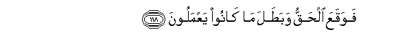

# فَوَقَعَ الْحَقُّ وَبَطَلَ مَا كَانُوا يَعْمَلُونَ 

##FawaqaAAa alhaqqu wabatala ma kanoo yaAAmaloona 

## 翻译(Translation)：

| Translator | 译文(Translation)                                            |
| :--------: | ------------------------------------------------------------ |
|    马坚    | 于是，真理昭著，而他们所演的魔术变成无用的。                 |
|  YUSUFALI  | Thus truth was confirmed, and all that they did was made of no effect. |
| PICKTHALL  | Thus was the Truth vindicated and that which they were doing was made vain. |
|   SHAKIR   | So the truth was established, and what they did became null. |

---

## 对位释义(Words Interpretation)：

| No   | العربية | 中文    | English | 曾用词 |
| ---- | ------: | ------- | ------- | ------ |
| 序号 |    阿文 | Chinese | 英文    | Used   |
| 7:118.1 | فَوَقَعَ   | 然后它降临   | then it have fallen | 参4:100.24 |
| 7:118.2 | الْحَقُّ   | 正确的，真理 | Right, truth        | 见2:26.17  |
| 7:118.3 | وَبَطَلَ   | 和它无用     | and became null     |            |
| 7:118.4 | مَا     | 什么         | what/ that which    | 见2:17.8   |
| 7:118.5 | كَانُوا  | 他们是       | they were           | 见2:10:11  |
| 7:118.6 | يَعْمَلُونَ | 他们的行为   | they do             | 见2:96.25  |

---