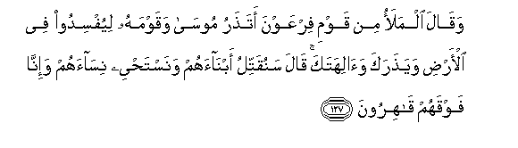

# وَقَالَ الْمَلَأُ مِنْ قَوْمِ فِرْعَوْنَ أَتَذَرُ مُوسَىٰ وَقَوْمَهُ لِيُفْسِدُوا فِي الْأَرْضِ وَيَذَرَكَ وَآلِهَتَكَ ۚ قَالَ سَنُقَتِّلُ أَبْنَاءَهُمْ وَنَسْتَحْيِي نِسَاءَهُمْ وَإِنَّا فَوْقَهُمْ قَاهِرُونَ 

##Waqala almalao min qawmi firAAawna atatharu moosa waqawmahu liyufsidoo fee al-ardi wayatharaka waalihataka qala sanuqattilu abnaahum wanastahyee nisaahum wa-inna fawqahum qahiroona 

## 翻译(Translation)：

| Translator | 译文(Translation)                                            |
| :--------: | ------------------------------------------------------------ |
|    马坚    | 法老的百姓中的众领袖说：难道你要任随穆萨和他的宗族在地方上作恶，并抛弃你和你的众神灵吗？他说：我们要屠杀他们的儿子，保全他们的妇女，我们确是统治他们的。 |
|  YUSUFALI  | Said the chiefs of Pharaoh's people: "Wilt thou leave Moses and his people, to spread mischief in the land, and to abandon thee and thy gods?" He said: "Their male children will we slay; (only) their females will we save alive; and we have over them (power) irresistible." |
| PICKTHALL  | The chiefs of Pharaoh's people said: (O King), wilt thou suffer Moses and his people to make mischief in the land, and flout thee and thy gods? He said: We will slay their sons and spare their women, for lo! we are in power over them. |
|   SHAKIR   | And the chiefs of Firon's people said: Do you leave Musa and his people to make mischief in the land and to forsake you and your gods? He said: We will slay their sons and spare their women, and surely we are masters over them. |

---

## 对位释义(Words Interpretation)：

| No   | العربية | 中文    | English | 曾用词 |
| ---- | ------: | ------- | ------- | ------ |
| 序号 |    阿文 | Chinese | 英文    | Used   |
| 7:127.1  | وَقَالَ    | 和他说，     | and he said       | 见2:118.1  |
| 7:127.2  | الْمَلَأُ   | 众领袖       | The leaders       | 见7:60.2   |
| 7:127.3  | مِنْ      | 从           | from              | 见2:4.8    |
| 7:127.4  | قَوْمِ     | 我的宗族     | my people         | 见2:54.6   |
| 7:127.5  | فِرْعَوْنَ   | 法老         | Pharaoh           | 见2:49.5   |
| 7:127.6  | أَتَذَرُ    | 你任随吗？   | Do you leave      |            |
| 7:127.7  | مُوسَىٰ    | 穆萨         | Moses             | 见2:51.3   |
| 7:127.8  | وَقَوْمَهُ   | 和他的宗族   | and his people    |            |
| 7:127.9  | لِيُفْسِدُوا | 以便他们作恶 | to make mischief  |            |
| 7:127.10 | فِي      | 在           | in                | 见2:10.1   |
| 7:127.11 | الْأَرْضِ   | 大地         | Earth             | 见2:22.4   |
| 7:127.12 | وَيَذَرَكَ   | 和他抛弃你   | and forsake you   |            |
| 7:127.13 | وَآلِهَتَكَ  | 和你的众神灵 | and your gods     |            |
| 7:127.14 | قَالَ     | 他说，       | He said           | 见2:30.2   |
| 7:127.15 | سَنُقَتِّلُ   | 我们将杀     | We will slay      |            |
| 7:127.16 | أَبْنَاءَهُمْ | 他们的儿子   | their sons        | 见2:146.7  |
| 7:127.17 | وَنَسْتَحْيِي | 和我们使活   | and we save alive |            |
| 7:127.18 | نِسَاءَهُمْ  | 他们的众妇女 | their women       |            |
| 7:127.19 | وَإِنَّا    | 和我们       | and we            | 见2:70.13  |
| 7:127.20 | فَوْقَهُمْ   | 他们之上     | above them        | 见2:212.12 |
| 7:127.21 | قَاهِرُونَ  | 众主权       | power             |            |

---