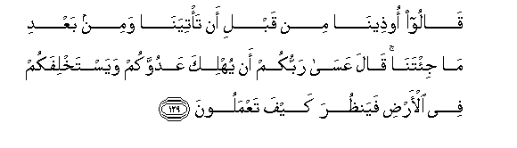

# قَالُوا أُوذِينَا مِنْ قَبْلِ أَنْ تَأْتِيَنَا وَمِنْ بَعْدِ مَا جِئْتَنَا ۚ قَالَ عَسَىٰ رَبُّكُمْ أَنْ يُهْلِكَ عَدُوَّكُمْ وَيَسْتَخْلِفَكُمْ فِي الْأَرْضِ فَيَنْظُرَ كَيْفَ تَعْمَلُونَ 

##Qaloo ootheena min qabli an ta/tiyana wamin baAAdi ma ji/tana qala AAasa rabbukum an yuhlika AAaduwwakum wayastakhlifakum fee al-ardi fayanthura kayfa taAAmaloona 

## 翻译(Translation)：

| Translator | 译文(Translation)                                            |
| :--------: | ------------------------------------------------------------ |
|    马坚    | 他们说：你到来之前，我们受虐待，你到来之后，我们仍然受虐待！他说：你们的主，或许会毁灭你们的仇敌，而以你们为这地方的代治者，看看你们是怎样工作的。 |
|  YUSUFALI  | They said: "We have had (nothing but) trouble, both before and after thou camest to us." He said: "It may be that your Lord will destroy your enemy and make you inheritors in the earth; that so He may try you by your deeds." |
| PICKTHALL  | They said: We suffered hurt before thou camest unto us, and since thou hast come unto us. He said: It may be that your Lord is going to destroy your adversary and make you viceroys in the earth, that He may see how ye behave. |
|   SHAKIR   | They said: We have been persecuted before you came to us and since you have come to us. He said: It may be that your Lord will destroy your enemy and make you rulers in the land, then He will see how you act. |

---

## 对位释义(Words Interpretation)：

| No   | العربية | 中文    | English | 曾用词 |
| ---- | ------: | ------- | ------- | ------ |
| 序号 |    阿文 | Chinese | 英文    | Used   |
| 7:129.1  | قَالُوا     | 他们说，             | They said               | 见2:11.8  |
| 7:129.2  | أُوذِينَا    | 我们受虐待           | We have been persecuted |           |
| 7:129.3  | مِنْ        | 从                   | from                    | 见2:4.8   |
| 7:129.4  | قَبْلِ       | 以前                 | Before                  | 见2:25.24 |
| 7:129.5  | أَنْ        | 该                   | that                    | 见2:26.5  |
| 7:129.6  | تَأْتِيَنَا    | 你来到我们           | you came to us          |           |
| 7:129.7  | وَمِنْ       | 和从                 | And from                | 见2:8.1   |
| 7:129.8  | بَعْدِ       | 之后                 | after                   | 见2:27.6  |
| 7:129.9  | مَا        | 什么                 | what/ that which        | 见2:17.8  |
| 7:129.10 | جِئْتَنَا     | 你来至我们           | you have come to us     |           |
| 7:129.11 | قَالَ       | 他说，               | He said                 | 见2:30.2  |
| 7:129.12 | عَسَىٰ       | 他或许               | It may be               |           |
| 7:129.13 | رَبُّكُمْ      | 你们的养主           | your Lord               | 见3:124.8 |
| 7:129.14 | أَنْ        | 该                   | that                    | 见2:26.5  |
| 7:129.15 | يُهْلِكَ      | 他毁灭               | he destroy              | 见5:17.20 |
| 7:129.16 | عَدُوَّكُمْ     | 你们的仇敌           | your enemy              |           |
| 7:129.17 | وَيَسْتَخْلِفَكُمْ | 和他使你们成为代治者 | and make you inheritors |           |
| 7:129.18 | فِي        | 在                   | in                      | 见2:10.1  |
| 7:129.19 | الْأَرْضِ     | 大地                 | Earth                   | 见2:22.4  |
| 7:129.20 | فَيَنْظُرَ     | 因此他看看           | then He will see        |           |
| 7:129.21 | كَيْفَ       | 如何                 | How                     | 见2:28.1  |
| 7:129.22 | تَعْمَلُونَ    | 你们行为             | you do                  | 见2:74.37 |

---