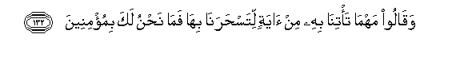

# وَقَالُوا مَهْمَا تَأْتِنَا بِهِ مِنْ آيَةٍ لِتَسْحَرَنَا بِهَا فَمَا نَحْنُ لَكَ بِمُؤْمِنِينَ 

##Waqaloo mahma ta/tina bihi min ayatin litasharana biha fama nahnu laka bimu/mineena 

## 翻译(Translation)：

| Translator | 译文(Translation)                                            |
| :--------: | ------------------------------------------------------------ |
|    马坚    | 他们说：无论你拿什么迹象来迷惑我们，我们绝不信仰你。         |
|  YUSUFALI  | They said (to Moses): "Whatever be the Signs thou bringest, to work therewith thy sorcery on us, we shall never believe in thee. |
| PICKTHALL  | And they said: Whatever portent thou bringest wherewith to bewitch us, we shall not put faith in thee. |
|   SHAKIR   | And they said: Whatever sign you may bring to us to charm us with it-- we will not believe in you. |

---

## 对位释义(Words Interpretation)：

| No   | العربية | 中文    | English | 曾用词 |
| ---- | ------: | ------- | ------- | ------ |
| 序号 |    阿文 | Chinese | 英文    | Used   |
| 7:132.1  | وَقَالُوا  | 和他们说     | and they say        | 见2:80.1  |
| 7:132.2  | مَهْمَا    | 无论         | Whatever            |           |
| 7:132.3  | تَأْتِنَا   | 你拿至我们   | you may bring to us |           |
| 7:132.4  | بِهِ      | 以它         | with it             | 见2:22.13 |
| 7:132.5  | مِنْ      | 从           | from                | 见2:4.8   |
| 7:132.6  | آيَةٍ     | 迹象         | the Signs           | 见2:106.4 |
| 7:132.7  | لِتَسْحَرَنَا | 以便迷惑我们 | to bewitch us       |           |
| 7:132.8  | بِهَا     | 在他们       | in them             | 见2:99.8  |
| 7:132.9  | فَمَا     | 什么，并未   | What                | 见2:16.6  |
| 7:132.10 | نَحْنُ     | 我们         | we                  | 见2:11.10 |
| 7:132.11 | لَكَ      | 在你         | in you              | 见2:30.22 |
| 7:132.12 | بِمُؤْمِنِينَ | 不相信       | Not believe         | 见2:8.11  |

---