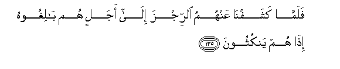

# فَلَمَّا كَشَفْنَا عَنْهُمُ الرِّجْزَ إِلَىٰ أَجَلٍ هُمْ بَالِغُوهُ إِذَا هُمْ يَنْكُثُونَ 

##Falamma kashafna AAanhumu alrrijza ila ajalin hum balighoohu itha hum yankuthoona 

## 翻译(Translation)：

| Translator | 译文(Translation)                                            |
| :--------: | ------------------------------------------------------------ |
|    马坚    | 当我替他们暂时消除灾难的时候，他们忽然背约了。               |
|  YUSUFALI  | But every time We removed the penalty from them according to a fixed term which they had to fulfil,- Behold! they broke their word! |
| PICKTHALL  | But when We did remove from them the terror for a term which they must reach, behold! they broke their covenant. |
|   SHAKIR   | But when We removed the plague from them till a term which they should attain lo! they broke (the promise). |

---

## 对位释义(Words Interpretation)：

| No   | العربية | 中文    | English | 曾用词 |
| ---- | ------: | ------- | ------- | ------ |
| 序号 |    阿文 | Chinese | 英文    | Used   |
| 7:135.1  | فَلَمَّا   | 但是当   | but when    | 见2:17.6   |
| 7:135.2  | كَشَفْنَا  | 我们移除 | We removed  |            |
| 7:135.3  | عَنْهُمُ   | 在他们   | on them     | 见2:86.9   |
| 7:135.4  | الرِّجْزَ  | 天灾     | the penalty | 见7:134.17 |
| 7:135.5  | إِلَىٰ    | 至       | to          | 见2:14.9   |
| 7:135.6  | أَجَلٍ    | 一个期间 | a time      | 见2:282.9  |
| 7:135.7  | هُمْ     | 他们     | they        | 见2:4.11   |
| 7:135.8  | بَالِغُوهُ | 达到它   | reach it    |            |
| 7:135.9  | إِذَا    | 当时     | when        | 见2:156.2  |
| 7:135.10 | هُمْ     | 他们     | they        | 见2:4.11   |
| 7:135.11 | يَنْكُثُونَ | 他们背约 | they broke  |            |

---