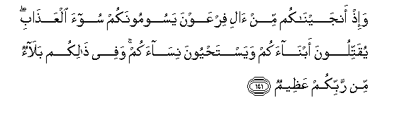

# وَإِذْ أَنْجَيْنَاكُمْ مِنْ آلِ فِرْعَوْنَ يَسُومُونَكُمْ سُوءَ الْعَذَابِ ۖ يُقَتِّلُونَ أَبْنَاءَكُمْ وَيَسْتَحْيُونَ نِسَاءَكُمْ ۚ وَفِي ذَٰلِكُمْ بَلَاءٌ مِنْ رَبِّكُمْ عَظِيمٌ 

##Wa-ith anjaynakum min ali firAAawna yasoomoonakum soo-a alAAathabi yuqattiloona abnaakum wayastahyoona nisaakum wafee thalikum balaon min rabbikum AAatheemun 

## 翻译(Translation)：

| Translator | 译文(Translation)                                            |
| :--------: | ------------------------------------------------------------ |
|    马坚    | 当时，我使你们脱离法老的臣民，他们使你们遭受酷刑，屠杀你们的儿子，保全你们的女子。此中有从你们的主降下的大难。 |
|  YUSUFALI  | And remember We rescued you from Pharaoh's people, who afflicted you with the worst of penalties, who slew your male children and saved alive your females: in that was a momentous trial from your Lord. |
| PICKTHALL  | And (remember) when We did deliver you from Pharaoh's folk who were afflicting you with dreadful torment, slaughtering your sons and sparing your women. That was a tremendous trial from your Lord. |
|   SHAKIR   | And when We delivered you from Firon's people who subjected you to severe torment, killing your sons and sparing your women, and in this there was a great trial from your Lord. |

---

## 对位释义(Words Interpretation)：

| No   | العربية | 中文    | English | 曾用词 |
| ---- | ------: | ------- | ------- | ------ |
| 序号 |    阿文 | Chinese | 英文    | Used   |
| 7:141.1  | وَإِذْ      | 和当时         | and when                 | 见2:30.1  |
| 7:141.2  | أَنْجَيْنَاكُمْ | 我们拯救你们   | We delivered you         | 参2:49.2  |
| 7:141.3  | مِنْ       | 从             | from                     | 见2:4.8   |
| 7:141.4  | آلِ       | 百姓           | The people               | 见2:49.4  |
| 7:141.5  | فِرْعَوْنَ    | 法老           | Pharaoh                  | 见2:49.5  |
| 7:141.6  | يَسُومُونَكُمْ | 他们使你们遭受 | they were afflicting you | 见2:49.6  |
| 7:141.7  | سُوءَ      | 恐怖的         | dreadful                 | 见2:49.7  |
| 7:141.8  | الْعَذَابِ   | 刑罚           | Torment                  | 见2:49.8  |
| 7:141.9  | يُقَتِّلُونَ   | 他们杀         | they were slaughtering   |           |
| 7:141.10 | أَبْنَاءَكُمْ  | 你们的儿子     | Your sons                | 见2:49.10 |
| 7:141.11 | وَيَسْتَحْيُونَ | 和留存         | and sparing              | 见2:49.11 |
| 7:141.12 | نِسَاءَكُمْ   | 你们的妇女     | Your women               | 见2:49.12 |
| 7:141.13 | وَفِي      | 和在           | and at                   | 见2:49.13 |
| 7:141.14 | ذَٰلِكُمْ     | 那个是         | That's it                | 见2:49.14 |
| 7:141.15 | بَلَاءٌ     | 苦难           | trial                    | 见2:49.15 |
| 7:141.16 | مِنْ       | 从             | from                     | 见2:4.8   |
| 7:141.17 | رَبِّكُمْ     | 你们的主       | Your Lord                | 见2:21.5  |
| 7:141.18 | عَظِيمٌ     | 重大           | Great                    | 见2:7.12  |

---